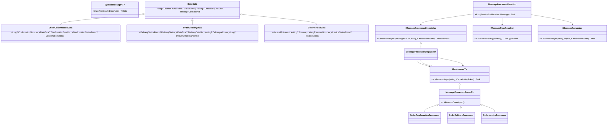
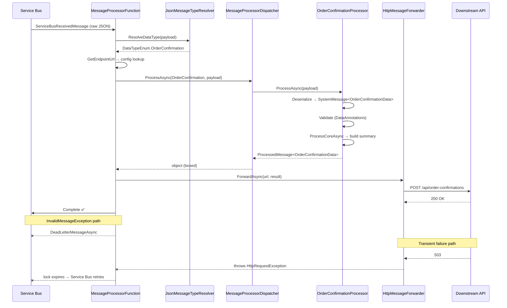

# LLD Wiki — Message Processing Pipeline

> **Pattern:** Event-driven dispatcher with typed payloads, validation, and pluggable forwarding.  
> **Stack:** Azure Functions (.NET 8, isolated worker) + Azure Service Bus.  
> **Companies:** Amazon, Flipkart, Swiggy, Razorpay, Zomato, Microsoft, Google.

---

## Interview Depth Map

| Level | Must cover |
|-------|-----------|
| **L4 / SDE-2** | Polymorphism, Template Method, DI, error classification |
| **L5 / Senior** | + Generic envelope, middleware pipeline, Outbox, ordered processing, DDD |
| **L6 / Staff** | + Dynamic dispatch, distributed guards, exactly-once semantics |
| **Interview ops** | 45-min pacing, sequence diagram, test code, Polly resilience |

---

## Table of Contents

**Core (L4)**
1. [Problem Statement](#1-problem-statement)
2. [How to Read Any Pipeline Problem](#2-how-to-read-any-pipeline-problem)
3. [Design Patterns in Play](#3-design-patterns-in-play)
4. [Layer Model](#4-layer-model)
5. [Data Model](#5-data-model)
6. [Pipeline Walkthrough](#6-pipeline-walkthrough)
7. [Error Classification](#7-error-classification)
8. [Testability & Anti-Patterns](#8-testability--anti-patterns)
9. [Class Diagram](#9-class-diagram)
10. [Extension: Adding a New Message Type](#10-extension-adding-a-new-message-type)

**Advanced (L5)**
11. [Generic Envelope & Rich Base Interface](#11-generic-envelope--rich-base-interface)
12. [Ordered Processing — State Machine & Order Guard](#12-ordered-processing--state-machine--order-guard)
13. [Middleware Pipeline Pattern](#13-middleware-pipeline-pattern)
14. [Outbox Pattern — Guaranteed Integrations](#14-outbox-pattern--guaranteed-integrations)
15. [Deferral vs Dead-Letter](#15-deferral-vs-dead-letter)

**DDD (L5–L6)**
16. [Why Anemic Models Fail](#16-why-anemic-models-fail)
17. [Value Objects](#17-value-objects)
18. [Aggregates — State + Behaviour](#18-aggregates--state--behaviour)
19. [Domain Events vs Integration Events](#19-domain-events-vs-integration-events)
20. [Repositories](#20-repositories)
21. [Layered Architecture](#21-layered-architecture)

**L6**
22. [Dynamic Dispatch & Assembly Scanning](#22-dynamic-dispatch--assembly-scanning)

**Interview Operations**
23. [45-Minute Pacing Guide](#23-45-minute-pacing-guide)
24. [Sequence Diagram](#24-sequence-diagram)
25. [Test Code](#25-test-code)
26. [Polly Retry & Circuit Breaker](#26-polly-retry--circuit-breaker)
27. [Q&A Bank](#27-qa-bank)

---

## 1. Problem Statement

An Azure Function receives JSON messages from a Service Bus topic. Each message is a typed envelope:

```jsonc
{
  "dataType": "OrderConfirmation",   // discriminator
  "data": { /* payload fields */ }
}
```

| `dataType`          | Payload class             | Key Fields |
|---------------------|---------------------------|-----------|
| `OrderConfirmation` | `OrderConfirmationData`   | confirmationNumber, confirmationDateUtc, status |
| `OrderDelivery`     | `OrderDeliveryData`       | deliveryStatus, deliveryDateUtc, address, trackingNumber |
| `OrderInvoice`      | `OrderInvoiceData`        | amount, currency, invoiceDateUtc, invoiceNumber, status |

**Pipeline requirements:**
1. Parse the raw JSON into the correct strongly-typed model.
2. Validate all required fields; dead-letter on failure.
3. Process each type — logic differs per type.
4. Forward the result via HTTP POST to a type-specific URL from config.
5. Log at each step; never crash the host on bad messages.

**Hard constraint:** Business logic must not depend on `ServiceBusReceivedMessage` or a concrete `HttpClient`.

---

## 2. How to Read Any Pipeline Problem

Before writing code, extract four axes:

| Axis | Question | Answer here |
|------|----------|-------------|
| **Variation** | What differs per variant? | Message structure, validation, processing logic |
| **Stability** | What never changes? | Envelope shape, pipeline steps (parse → validate → process → forward) |
| **Extension** | What gets added later? | New message types — zero edits to existing classes |
| **Dependency** | What external systems exist? | Service Bus (input), HTTP endpoint (output), config (endpoint URLs) |

These axes map directly to design decisions:
- Variation → polymorphism
- Stability → Template Method
- Extension → OCP
- Dependency → Adapter + `IOptions<T>`

---

## 3. Design Patterns in Play

| Pattern | Where | Why |
|---------|-------|-----|
| **Template Method** | `MessageProcessorBase<T>` | Fixed algorithm (deserialize → validate → delegate); invariants never duplicated |
| **Strategy** | `OrderConfirmationProcessor`, etc. | Interchangeable per-type logic; dispatcher is type-agnostic |
| **Command Router** | `MessageProcessorDispatcher` | Routes `DataTypeEnum` → correct `IProcessor<T>` |
| **Adapter** | `HttpMessageForwarder` | Hides `HttpClient` behind `IMessageForwarder`; domain unaware of HTTP |
| **Options Pattern** | `MessageProcessorOptions` via `IOptions<T>` | Strongly-typed config, validated at startup, mockable in tests |

---

## 4. Layer Model

```
┌──────────────────────────────────────────────────────────┐
│ Layer 1 — Entry Point (Thin Trigger)                     │
│ Receives raw bytes; owns dead-letter decision only       │
├──────────────────────────────────────────────────────────┤
│ Layer 2 — Routing (IMessageTypeResolver)                 │
│ Peeks at discriminator — no full parse yet               │
├──────────────────────────────────────────────────────────┤
│ Layer 3 — Parse + Validate (MessageProcessorBase<T>)     │
│ Deserialize → DataAnnotations validation                 │
├──────────────────────────────────────────────────────────┤
│ Layer 4 — Process (Concrete Processors)                  │
│ Type-specific business logic; returns ProcessedMessage<T>│
├──────────────────────────────────────────────────────────┤
│ Layer 5 — Dispatch (IMessageProcessorDispatcher)         │
│ Routes DataTypeEnum → IProcessor<T>; boxes result        │
├──────────────────────────────────────────────────────────┤
│ Layer 6 — Forward (IMessageForwarder)                    │
│ HTTP POST via IHttpClientFactory                         │
└──────────────────────────────────────────────────────────┘
```

---

## 5. Data Model

```csharp
// Discriminator — enum prevents typos and enables switch exhaustiveness
public enum DataTypeEnum { Unknown, OrderConfirmation, OrderDelivery, OrderInvoice }

// Generic envelope
public class SystemMessage<T> where T : BaseData, new()
{
    public required DataTypeEnum DataType { get; set; }
    public required T Data { get; set; }
}

// Shared audit fields on all payloads
public abstract class BaseData
{
    [Required] public long? OrderId { get; set; }
    [Required] public DateTime? CreateAtUtc { get; set; }
    [Required, MinLength(1)] public string? CreatedBy { get; set; }
    [Required] public Guid? MessageCorelationId { get; set; }
}

// Concrete payloads add only their own fields
public class OrderConfirmationData : BaseData
{
    [Required] public long? ConfirmationNumber { get; set; }
    [Required] public DateTime? ConfirmationDateUtc { get; set; }
    [Required] public ConfirmationStatusEnum? ConfirmationStatus { get; set; }
}

public class OrderInvoiceData : BaseData
{
    [Required] public decimal? Amount { get; set; }
    [Required, StringLength(3, MinimumLength = 3)] public string? Currency { get; set; }
    [Required] public DateTime? InvoiceDateUtc { get; set; }
    [Required] public long? InvoiceNumber { get; set; }
    [Required] public InvoiceStatusEnum? InvoiceStatus { get; set; }
}
```

> **Why nullable `[Required]`?** Deserialization succeeds even when fields are absent. The validator — not the deserializer — produces the user-friendly error message.

**Output envelope:**
```csharp
public sealed record ProcessedMessage<T> where T : BaseData, new()
{
    public required DataTypeEnum DataType { get; init; }
    public required T Data { get; init; }
    public required string Summary { get; init; }
    public required DateTimeOffset ProcessedAtUtc { get; init; }

    // Centralises creation; ProcessedAtUtc is always UTC-stamped here
    public static ProcessedMessage<T> Create(SystemMessage<T> message, string summary)
        => new() { DataType = message.DataType, Data = message.Data,
                   Summary = summary, ProcessedAtUtc = DateTimeOffset.UtcNow };
}
```

---

## 6. Pipeline Walkthrough

### Step 1 — Type Resolution (two-pass)

Peek at the discriminator only — no full-graph allocation until the type is known.

```csharp
public sealed class JsonMessageTypeResolver : IMessageTypeResolver
{
    public DataTypeEnum ResolveDataType(string messageBody)
    {
        if (string.IsNullOrWhiteSpace(messageBody))
            throw new InvalidMessageException("Message body is empty.");

        try
        {
            using var doc = JsonDocument.Parse(messageBody);

            if (!doc.RootElement.TryGetProperty("dataType", out var el) ||
                el.ValueKind != JsonValueKind.String)
                throw new InvalidMessageException("Missing or non-string 'dataType' property.");

            // Unknown guards against accidentally matching the sentinel enum value
            if (!Enum.TryParse<DataTypeEnum>(el.GetString(), ignoreCase: true, out var dataType)
                || dataType == DataTypeEnum.Unknown)
                throw new InvalidMessageException($"Unsupported dataType '{el.GetString()}'.");

            return dataType;
        }
        catch (JsonException ex)
        {
            throw new InvalidMessageException("Message body is not valid JSON.", ex);
        }
    }
}
```

### Step 2 — Template Method Base

```csharp
// Fixed algorithm: Deserialize → Validate → ProcessCoreAsync (abstract).
// Subclasses only override step 3; parse/validate invariants are never duplicated.
public abstract class MessageProcessorBase<T> : IProcessor<T> where T : BaseData, new()
{
    private static readonly JsonSerializerOptions SerializerOptions = BuildSerializerOptions();

    public async Task<ProcessedMessage<T>> ProcessAsync(string messageBody, CancellationToken ct = default)
    {
        var message = Deserialize(messageBody);
        Validate(message);
        return await ProcessCoreAsync(message, ct);
    }

    protected abstract Task<ProcessedMessage<T>> ProcessCoreAsync(SystemMessage<T> message, CancellationToken ct);

    // JsonException → InvalidMessageException so callers see one type for all bad-message cases
    private static SystemMessage<T> Deserialize(string body)
    {
        try
        {
            return JsonSerializer.Deserialize<SystemMessage<T>>(body, SerializerOptions)
                   ?? throw new InvalidMessageException($"Deserialization returned null for {typeof(T).Name}.");
        }
        catch (JsonException ex) { throw new InvalidMessageException($"Invalid JSON for {typeof(T).Name}.", ex); }
    }

    // DataAnnotations on each payload declare rules declaratively — no per-field if-checks needed
    private static void Validate(SystemMessage<T> message)
    {
        if (message.Data is null) throw new InvalidMessageException("Payload is missing.");

        var results = new List<ValidationResult>();
        if (!Validator.TryValidateObject(message.Data, new ValidationContext(message.Data), results, true))
        {
            var errors = string.Join("; ", results.Select(r => r.ErrorMessage).Where(e => e != null));
            throw new InvalidMessageException($"Payload invalid: {errors}");
        }
    }

    // Case-insensitive + enum-from-string tolerates "orderconfirmation" and "OrderConfirmation"
    private static JsonSerializerOptions BuildSerializerOptions()
    {
        var o = new JsonSerializerOptions { PropertyNameCaseInsensitive = true };
        o.Converters.Add(new JsonStringEnumConverter());
        return o;
    }
}
```

### Step 3 — Concrete Processor (example)

```csharp
public sealed class OrderConfirmationProcessor : MessageProcessorBase<OrderConfirmationData>
{
    protected override Task<ProcessedMessage<OrderConfirmationData>> ProcessCoreAsync(
        SystemMessage<OrderConfirmationData> message, CancellationToken ct)
    {
        var data    = message.Data;
        var orderId = OrderId.From(data.OrderId!.Value);  // domain value object — invalid IDs are impossible
        var summary = $"Confirmation #{data.ConfirmationNumber!.Value} for order {orderId} " +
                      $"is {data.ConfirmationStatus} as of {data.ConfirmationDateUtc:O}.";

        return Task.FromResult(ProcessedMessage<OrderConfirmationData>.Create(message, summary));
    }
}
```

### Step 4 — Dispatcher

```csharp
// Routes DataTypeEnum → IProcessor<T> and boxes the result to object.
// BoxAsync uses await (not ContinueWith) so exceptions propagate correctly.
public sealed class MessageProcessorDispatcher : IMessageProcessorDispatcher
{
    public Task<object> ProcessAsync(DataTypeEnum dataType, string body, CancellationToken ct = default)
        => dataType switch
        {
            DataTypeEnum.OrderConfirmation => BoxAsync(_confirmationProcessor.ProcessAsync(body, ct)),
            DataTypeEnum.OrderDelivery     => BoxAsync(_deliveryProcessor.ProcessAsync(body, ct)),
            DataTypeEnum.OrderInvoice      => BoxAsync(_invoiceProcessor.ProcessAsync(body, ct)),
            _                              => throw new InvalidMessageException($"Unsupported type '{dataType}'.")
        };

    private static async Task<object> BoxAsync<T>(Task<T> task) => (await task)!;
}
```

> **Why `Task<object>`?** `ProcessedMessage<OrderConfirmationData>` and `ProcessedMessage<OrderDeliveryData>` have no common generic base. `object` is the covariance escape hatch. The forwarder serializes it — downstream gets full typed JSON regardless.

### Step 5 — HTTP Forwarder

```csharp
// IHttpClientFactory manages socket pooling — never use new HttpClient().
public sealed class HttpMessageForwarder : IMessageForwarder
{
    private readonly IHttpClientFactory _factory;
    public HttpMessageForwarder(IHttpClientFactory factory) => _factory = factory;

    public async Task ForwardAsync(string url, object payload, CancellationToken ct = default)
    {
        if (string.IsNullOrWhiteSpace(url))
            throw new InvalidOperationException("Downstream endpoint URL must be configured.");

        var client = _factory.CreateClient(nameof(HttpMessageForwarder));
        using var response = await client.PostAsJsonAsync(url, payload, ct);

        // Non-2xx: throw so Service Bus retries (transient downstream failure)
        if (!response.IsSuccessStatusCode)
        {
            var body = await response.Content.ReadAsStringAsync(ct);
            throw new HttpRequestException($"'{url}' returned {(int)response.StatusCode} ({response.ReasonPhrase}). {body}");
        }
    }
}
```

### Step 6 — Entry Point (Azure Function)

```csharp
// Thin orchestrator — only catches InvalidMessageException; everything else bubbles for SB retry.
public class MessageProcessorFunction
{
    [Function(nameof(MessageProcessorFunction))]
    public async Task Run(
        [ServiceBusTrigger("mytopic", "mysubscription", Connection = "ServiceBusConnection")]
        ServiceBusReceivedMessage message,
        ServiceBusMessageActions messageActions,
        CancellationToken cancellationToken)
    {
        var payload = message.Body.ToString();
        try
        {
            // Step 1: resolve type from discriminator
            var dataType = _typeResolver.ResolveDataType(payload);

            // Step 2: look up downstream endpoint from config
            var endpointUrl = GetEndpointUrl(dataType);

            // Step 3: deserialize, validate, process
            var result = await _dispatcher.ProcessAsync(dataType, payload, cancellationToken);

            // Step 4: POST to downstream system
            await _forwarder.ForwardAsync(endpointUrl, result, cancellationToken);
        }
        catch (InvalidMessageException ex)
        {
            // Structural problem — retrying will never help; dead-letter immediately
            _logger.LogWarning(ex, "Dead-lettering invalid message {Id}.", message.MessageId);
            await messageActions.DeadLetterMessageAsync(message, "Invalid message", ex.Message, cancellationToken);
        }
        // HttpRequestException, InvalidOperationException bubble up → SB retry / ops alert
    }

    // Missing URL = deployment bug, not a bad message → InvalidOperationException (not dead-letter)
    private string GetEndpointUrl(DataTypeEnum dataType)
    {
        var key = dataType.ToString();
        if (_options.Value.EndpointUrls.TryGetValue(key, out var url) && !string.IsNullOrWhiteSpace(url))
            return url;
        throw new InvalidOperationException($"No endpoint URL configured for '{key}'.");
    }
}
```

### Step 7 — DI Registration

```csharp
// ValidateDataAnnotations + ValidateOnStart: host fails at boot if endpoint URLs are missing
builder.Services
    .AddOptions<MessageProcessorOptions>()
    .BindConfiguration(MessageProcessorOptions.SectionName)
    .ValidateDataAnnotations()
    .ValidateOnStart();

// Named client for socket-pool isolation
builder.Services.AddHttpClient(nameof(HttpMessageForwarder));

builder.Services.AddSingleton<IMessageTypeResolver,        JsonMessageTypeResolver>();
builder.Services.AddSingleton<IMessageForwarder,           HttpMessageForwarder>();
builder.Services.AddSingleton<IMessageProcessorDispatcher, MessageProcessorDispatcher>();

// Adding a type = one new line here + one case in dispatcher
builder.Services.AddSingleton<IProcessor<OrderConfirmationData>, OrderConfirmationProcessor>();
builder.Services.AddSingleton<IProcessor<OrderDeliveryData>,     OrderDeliveryProcessor>();
builder.Services.AddSingleton<IProcessor<OrderInvoiceData>,      OrderInvoiceProcessor>();
```

---

## 7. Error Classification

| Exception | Cause | Action |
|-----------|-------|--------|
| `InvalidMessageException` | Bad JSON, missing field, unsupported type | **Dead-letter** — retrying won't fix it |
| `HttpRequestException` | Downstream 5xx / network failure | **Bubble up** → Service Bus retries |
| `InvalidOperationException` | Missing config | **Bubble up** → alert ops |
| Any other | Bug in processor | **Bubble up** → retry → eventually dead-letter |

```
Raw message arrives
  ├─ invalid JSON / unknown dataType     → InvalidMessageException → dead-letter
  ├─ missing endpoint URL in config      → InvalidOperationException → ops alert
  ├─ missing required payload field      → InvalidMessageException → dead-letter
  ├─ downstream HTTP 5xx                 → HttpRequestException → Service Bus retries
  └─ success                             → message completed ✅
```

---

## 8. Testability & Anti-Patterns

### Every boundary is an interface

| Component | How to test |
|-----------|-------------|
| `JsonMessageTypeResolver` | Unit: raw JSON strings → assert `DataTypeEnum` |
| `OrderConfirmationProcessor` | Unit: crafted JSON → assert `ProcessedMessage` fields |
| `MessageProcessorDispatcher` | Unit: `Mock<IProcessor<T>>` → verify routing |
| `HttpMessageForwarder` | Unit: `MockHttpMessageHandler` (RichardSzalay.MockHttp) |
| `MessageProcessorFunction` | Integration: all mocks → verify dead-letter calls |

### Anti-Patterns

| Anti-pattern | Consequence |
|---|---|
| All logic inside `Run()` | Untestable, violates SRP |
| `new HttpClient()` per invocation | Socket exhaustion under load |
| `if (type == "OrderConfirmation")` stringly-typed routing | Typos, no compile-time safety |
| Catching `HttpRequestException` and completing the message | Silently drops messages that should retry |
| `ProcessAsync(ServiceBusReceivedMessage msg)` | Forces Service Bus SDK in unit tests |
| Hardcoded endpoint URLs | Breaks multi-environment deployments |
| `ContinueWith` to box async results | Swallows exceptions on faulted tasks |

---

## 9. Class Diagram



---

## 10. Extension: Adding a New Message Type

To add `OrderReturn`:
1. Add `OrderReturn` to `DataTypeEnum`
2. Create `OrderReturnData : BaseData` with `[Required]` fields
3. Create `OrderReturnProcessor : MessageProcessorBase<OrderReturnData>`
4. Add `DataTypeEnum.OrderReturn` case to `MessageProcessorDispatcher`
5. Register `IProcessor<OrderReturnData>` in `Program.cs`
6. Add endpoint URL to `local.settings.json`

**Zero changes** to `MessageProcessorFunction`, `MessageProcessorBase`, or `HttpMessageForwarder`. This is OCP in practice.

---

## 11. Generic Envelope & Rich Base Interface

Upgrade `BaseData` + `DataTypeEnum` to `IMessage` + `BaseMessage<TBody>` when you need ordering guarantees, richer logging, or open extensibility.

```csharp
// Marker interface — middleware and dispatcher work on IMessage; no domain type imports required
public interface IMessage
{
    Guid MessageId { get; }
    Guid CorrelationId { get; }   // ties all messages in one business transaction
    int SequenceNumber { get; }   // ordering token — enables the Order Guard (§12)
    string MessageType { get; }   // string discriminator; new producers don't need to change an enum
    DateTimeOffset CreatedAt { get; }
}

// Envelope = infrastructure metadata; TBody = domain data — they evolve independently
public abstract record BaseMessage<TBody> : IMessage
{
    public Guid MessageId { get; init; } = Guid.NewGuid();
    public Guid CorrelationId { get; init; }
    public int SequenceNumber { get; init; }
    public DateTimeOffset CreatedAt { get; init; } = DateTimeOffset.UtcNow;
    public abstract string MessageType { get; }
    public TBody Body { get; init; } = default!;
}

public record OrderConfirmedMessage : BaseMessage<OrderConfirmedBody>
{
    public override string MessageType => "order.confirmed";
    public string ConfirmedBy { get; init; } = string.Empty;
}
```

| Concern | Basic | Advanced |
|---------|-------|---------|
| Adding a new type | Enum change required | Drop new record — zero edits elsewhere |
| Structured logging | Must cast to get `CorrelationId` | Middleware uses `IMessage` directly |
| Ordering | Not modelled | `SequenceNumber` enables Order Guard |
| Immutability | Mutable class | `record` — value equality, `with` expressions |

---

## 12. Ordered Processing — State Machine & Order Guard

Service Bus does **not guarantee delivery order** across sessions. Even session-enabled queues can have retried messages arrive out of order.

```
Timeline (what can happen):
  t=0  →  order.placed    arrives, processed ✅
  t=1  →  order.shipped   arrives ← predecessor order.confirmed NOT YET seen!
  t=2  →  order.confirmed arrives
```

### State Machine

```csharp
public static class OrderFlowTransitions
{
    private static readonly Dictionary<string, HashSet<string>> _allowed = new()
    {
        { "",                new() { "order.placed" } },
        { "order.placed",    new() { "order.confirmed", "order.cancelled" } },
        { "order.confirmed", new() { "order.shipped",   "order.cancelled" } },
        { "order.shipped",   new() { } },    // terminal
        { "order.cancelled", new() { } },    // terminal
    };

    public static bool IsAllowed(string current, string next)
        => _allowed.TryGetValue(current, out var allowed) && allowed.Contains(next);

    public static bool IsTerminal(string status) => status is "order.shipped" or "order.cancelled";
}
```

### Order Guard (Redis-backed)

```csharp
public interface IOrderGuard
{
    // Returns true = process now; false = out-of-order, defer; throws for illegal transitions
    Task<bool> CanProcessAsync(IMessage message, CancellationToken ct);
    Task MarkProcessedAsync(IMessage message, CancellationToken ct);
}

public class RedisOrderGuard : IOrderGuard
{
    public async Task<bool> CanProcessAsync(IMessage message, CancellationToken ct)
    {
        var state = await GetStateAsync($"flow:{message.CorrelationId}", ct)
                    ?? new MessageFlowState { CorrelationId = message.CorrelationId };

        // Idempotency — already processed this sequence number or a later one
        if (state.LastProcessedSequence >= message.SequenceNumber) return false;

        if (!OrderFlowTransitions.IsAllowed(state.CurrentStatus, message.MessageType))
        {
            if (OrderFlowTransitions.IsTerminal(state.CurrentStatus))
                throw new InvalidOperationException(
                    $"Flow is terminal at '{state.CurrentStatus}'. Cannot accept '{message.MessageType}'.");
            return false;  // valid but arrived too early — defer
        }

        return true;
    }
}
```

**Why Redis?** O(1) get/set, sub-millisecond latency, TTL-based self-cleanup when an order reaches a terminal state. SQL adds 1–20ms on the hot path.

**Failure mode:** Fail-open (accept rare duplicate) for high-availability SLAs. Fail-closed (reject until Redis recovers) for payment-correctness SLAs.

---

## 13. Middleware Pipeline Pattern

Cross-cutting concerns (logging, ordering, outbox) belong in a **pipeline**, not inside handlers. Same model as ASP.NET Core middleware.

```csharp
public delegate Task MessageHandlerDelegate(IMessage message, CancellationToken ct);

public interface IMessageMiddleware
{
    Task InvokeAsync(IMessage message, MessageHandlerDelegate next, CancellationToken ct);
}
```

**Three standard middlewares (outermost → innermost):**

```csharp
// 1. Correlation logging — BeginScope so all log lines carry CorrelationId automatically
public class CorrelationLoggingMiddleware : IMessageMiddleware
{
    public async Task InvokeAsync(IMessage message, MessageHandlerDelegate next, CancellationToken ct)
    {
        using var scope = _logger.BeginScope(new Dictionary<string, object>
            { ["CorrelationId"] = message.CorrelationId, ["MessageType"] = message.MessageType });
        var sw = Stopwatch.StartNew();
        try   { await next(message, ct); _logger.LogInformation("[END] {Type} {Ms}ms", message.MessageType, sw.ElapsedMilliseconds); }
        catch (Exception ex) { _logger.LogError(ex, "[FAIL] {Type}", message.MessageType); throw; }
    }
}

// 2. Order guard — parks out-of-order messages; marks processed only AFTER handler succeeds
public class OrderGuardMiddleware : IMessageMiddleware
{
    public async Task InvokeAsync(IMessage message, MessageHandlerDelegate next, CancellationToken ct)
    {
        if (!await _guard.CanProcessAsync(message, ct)) { await _deferral.DeferAsync(message, ct); return; }
        await next(message, ct);
        await _guard.MarkProcessedAsync(message, ct);  // atomicity: only updates state on success
    }
}

// 3. Outbox publisher — fires integrations only after the handler succeeds
public class OutboxMiddleware : IMessageMiddleware
{
    public async Task InvokeAsync(IMessage message, MessageHandlerDelegate next, CancellationToken ct)
    {
        await next(message, ct);
        await _outbox.PublishPendingAsync(message.CorrelationId, ct);
    }
}
```

**Pipeline builder (Russian-doll composition):**

```csharp
public class MessagePipeline
{
    public MessageHandlerDelegate Build(MessageHandlerDelegate terminal)
    {
        var pipeline = terminal;
        foreach (var mw in _middlewares.Reverse())
        {
            var current = mw; var next = pipeline;
            pipeline = (msg, ct) => current.InvokeAsync(msg, next, ct);
        }
        return pipeline;
    }
}
```

Execution order: `Logging → OrderGuard → Outbox → Handler → Outbox → OrderGuard → Logging`

---

## 14. Outbox Pattern — Guaranteed Integrations

**The dual-write problem:** handler saves to DB ✅ → calls Payment API ❌ → message retried → **payment charged twice**.

**The fix:** write an `OutboxEntry` in the **same DB transaction** as the handler write. HTTP calls happen after the transaction commits. A background sweeper retries unpublished entries.

```csharp
public class OutboxEntry
{
    public Guid EntryId { get; init; } = Guid.NewGuid();
    public IntegrationType IntegrationType { get; init; }
    public string Payload { get; init; } = string.Empty;
    public bool IsPublished { get; set; }
}

public interface IOutboxService
{
    Task EnqueueAsync(Guid correlationId, OutboxEntry entry, CancellationToken ct); // call inside same txn
    Task PublishPendingAsync(Guid correlationId, CancellationToken ct);              // called by OutboxMiddleware
}
```

Send `EntryId` as `Idempotency-Key` header → downstream deduplicates on retries.

**Recovery flow:**

```
Handler writes DB + OutboxEntry (same transaction) ✅
  │
  ▼ OutboxMiddleware calls PublishPendingAsync
  ├─ HTTP succeeds → mark IsPublished = true ✅
  └─ HTTP fails   → entry stays unpublished
                      │
                      ▼ background IHostedService sweeper (every 30s)
                      └─ retry with same EntryId as Idempotency-Key ✅
```

---

## 15. Deferral vs Dead-Letter

| Scenario | Action | Why |
|----------|--------|-----|
| Invalid JSON | Dead-letter | Will never become valid |
| Missing required field | Dead-letter | Structural — not transient |
| Illegal state transition (terminal flow) | Dead-letter | Data corruption / bug |
| **Out-of-order arrival** | **Defer** | Valid message — arrived too early |
| Transient HTTP 5xx | Bubble up / retry | Will likely succeed on next attempt |
| Handler bug (NullRef) | Retry → eventually dead-letter | Exhaust `MaxDeliveryCount` |

`DeferMessageAsync(message)` moves the message to **Deferred** state in the main queue — it won't redeliver automatically. A sweeper must call `ReceiveDeferredMessageAsync(sequenceNumber)` once Redis confirms the predecessor state is complete.

**Key distinction:** Dead-letter = permanent (human intervention needed). Deferral = temporary hold for a valid but early-arriving message.

---

## 16. Why Anemic Models Fail

The baseline uses pure data bags — all rules live outside the data:

```csharp
// ❌ Anemic — ConfirmationStatus can be set to anything from anywhere
public class OrderConfirmationData : BaseData
{
    public ConfirmationStatusEnum? ConfirmationStatus { get; set; }
}
```

Problems:
- **Rules scattered** — validation in `MessageProcessorBase`, transitions in `OrderFlowTransitions`, business decisions in processors
- **Illegal state is constructable** — nothing stops `data.ConfirmationStatus = Rejected` after `Confirmed`
- **Hard to test** — testing "cannot confirm a cancelled order" requires the full processor stack

DDD moves rules into the domain object itself.

---

## 17. Value Objects

Immutable, self-validating, identity by value. You cannot create an invalid instance.

```csharp
// OrderId — positive integers only
public readonly record struct OrderId
{
    public long Value { get; }
    public OrderId(long value)
    {
        if (value <= 0) throw new DomainException($"OrderId must be positive, got {value}.");
        Value = value;
    }
    public static OrderId From(long value) => new(value);
    public static implicit operator long(OrderId id) => id.Value;  // transparent to callers expecting long
    public override string ToString() => Value.ToString();
}

// Money — amount and currency are always kept together; currency normalised to upper-case
public readonly record struct Money
{
    public decimal Amount { get; }
    public string Currency { get; }
    public Money(decimal amount, string currency)
    {
        if (amount < 0) throw new DomainException($"Amount cannot be negative: {amount}.");
        if (string.IsNullOrWhiteSpace(currency) || currency.Length != 3)
            throw new DomainException($"Currency must be 3-letter ISO code, got '{currency}'.");
        Amount = amount; Currency = currency.ToUpperInvariant();
    }
    public static Money From(decimal amount, string currency) => new(amount, currency);
    public override string ToString() => $"{Amount:F2} {Currency}";
}

// TrackingNumber — zero-padded display format owned by the domain
public readonly record struct TrackingNumber
{
    public long Value { get; }
    public TrackingNumber(long value)
    {
        if (value <= 0) throw new DomainException("Tracking number must be positive.");
        Value = value;
    }
    public static TrackingNumber From(long value) => new(value);
    public override string ToString() => Value.ToString("D12");  // zero-padded to 12 digits for carrier APIs
}
```

`PlaceOrder(OrderId, Money)` is self-documenting. `PlaceOrder(long, decimal)` is not. And `Money(-5, "INR")` throws at construction — the invariant is at the type boundary, not scattered in `if` checks.

---

## 18. Aggregates — State + Behaviour

All state changes go through methods. External code cannot mutate state directly.

```csharp
public class Order
{
    // Private setters — external code cannot mutate state directly
    public OrderId Id { get; private set; }
    public Guid CorrelationId { get; private set; }
    public OrderStatus Status { get; private set; }
    public string CustomerId { get; private set; } = string.Empty;
    public Money TotalAmount { get; private set; }
    public ConfirmationDetails? Confirmation { get; private set; }
    public DeliveryDetails? Delivery { get; private set; }
    public CancellationDetails? Cancellation { get; private set; }

    // Domain events flushed by the repository after SaveAsync
    private readonly List<IDomainEvent> _domainEvents = new();
    public IReadOnlyList<IDomainEvent> DomainEvents => _domainEvents.AsReadOnly();

    // Factory — named intent is clearer than a public constructor
    public static Order Place(OrderId id, string customerId, Money amount, Guid correlationId)
    {
        if (string.IsNullOrWhiteSpace(customerId)) throw new DomainException("CustomerId required.");
        var order = new Order { Id = id, CorrelationId = correlationId, CustomerId = customerId,
                                TotalAmount = amount, Status = OrderStatus.Placed };
        order._domainEvents.Add(new OrderPlacedEvent(order.Id, correlationId, amount));
        return order;
    }

    public void Confirm(string confirmedBy, long confirmationNumber, DateTime confirmedAtUtc)
    {
        EnsureStatus(OrderStatus.Placed, "confirm");
        if (string.IsNullOrWhiteSpace(confirmedBy)) throw new DomainException("ConfirmedBy is required.");
        Confirmation = new ConfirmationDetails(confirmationNumber, confirmedAtUtc, confirmedBy);
        Status = OrderStatus.Confirmed;
        _domainEvents.Add(new OrderConfirmedEvent(Id, CorrelationId, confirmationNumber, confirmedBy));
    }

    public void Ship(TrackingNumber tracking, string carrier, DeliveryAddress address, DateTime dateUtc)
    {
        EnsureStatus(OrderStatus.Confirmed, "ship");
        Delivery = new DeliveryDetails(tracking, carrier, address, dateUtc);
        Status = OrderStatus.Shipped;
        _domainEvents.Add(new OrderShippedEvent(Id, CorrelationId, tracking, carrier));
    }

    public void Cancel(string reason)
    {
        if (Status == OrderStatus.Shipped)   throw new DomainException("Cannot cancel a shipped order.");
        if (Status == OrderStatus.Cancelled) throw new DomainException("Order is already cancelled.");
        if (string.IsNullOrWhiteSpace(reason)) throw new DomainException("Reason is required.");
        Cancellation = new CancellationDetails(reason, DateTimeOffset.UtcNow);
        Status = OrderStatus.Cancelled;
        _domainEvents.Add(new OrderCancelledEvent(Id, CorrelationId, reason));
    }

    public void ClearDomainEvents() => _domainEvents.Clear();

    private void EnsureStatus(OrderStatus required, string op)
    {
        if (Status != required)
            throw new DomainException($"Cannot {op} order {Id} in '{Status}'. Required: '{required}'.");
    }
}
```

| Concern | Anemic | Aggregate |
|---------|--------|-----------|
| Confirming | `data.ConfirmationStatus = Confirmed` from anywhere | `order.Confirm(...)` — the only way |
| Invalid state | Possible via any property assignment | Impossible — `Confirm()` throws if not `Placed` |
| Rule location | Scattered across 4 files | Co-located with the state it protects |
| Unit test | Needs full processor stack | `Order.Place(...); order.Confirm(...)` — zero infra |

---

## 19. Domain Events vs Integration Events

| | Domain Event | Integration Event |
|--|---|---|
| **Raised by** | Aggregate method | Repository `SaveAsync` |
| **Transport** | In-process list | Outbox → Service Bus / Kafka |
| **Timing** | Before DB commit | After DB commit |
| **Consumer** | Same bounded context | Another microservice |
| **Failure** | Rolls back with transaction | Outbox guarantees at-least-once |

```csharp
// Domain event — pure C#, no broker dependency
public record OrderConfirmedEvent(OrderId OrderId, Guid CorrelationId, long ConfirmationNumber, string ConfirmedBy)
    : IDomainEvent
{
    public Guid EventId { get; } = Guid.NewGuid();
    public DateTimeOffset OccurredAt { get; } = DateTimeOffset.UtcNow;
}

// Integration event — serialized to outbox, crosses service boundaries via broker
public record OrderConfirmedIntegrationEvent
{
    public Guid CorrelationId { get; init; }
    public long OrderId { get; init; }
    public long ConfirmationNumber { get; init; }
    public DateTimeOffset ConfirmedAt { get; init; }
}
```

**Two-stage flow:**
```
order.Confirm(...)
  │ raises OrderConfirmedEvent (in-memory, same process)
  ▼
Repository.SaveAsync(order)
  ├─ Persist aggregate state
  ├─ Dispatch domain events (in-process handlers, same txn scope)
  ├─ Convert to outbox entries (same txn)
  └─ db.SaveChangesAsync() — commits everything atomically
       │
       ▼ background sweeper
       POST to NotificationService (Idempotency-Key = EntryId)
```

---

## 20. Repositories

The domain layer declares the interface. The infrastructure layer implements it. EF Core never leaks into the domain.

```csharp
// Domain layer — no ORM imports
public interface IOrderRepository
{
    Task<Order?> FindByIdAsync(OrderId id, CancellationToken ct);
    Task<Order?> FindByCorrelationIdAsync(Guid correlationId, CancellationToken ct);
    Task SaveAsync(Order order, CancellationToken ct);
}
```

```csharp
// Infrastructure layer — EF Core allowed here
public class EfOrderRepository : IOrderRepository
{
    public async Task SaveAsync(Order order, CancellationToken ct)
    {
        _db.Orders.Update(order);

        await _domainEventDispatcher.DispatchAsync(order.DomainEvents, ct); // in-process

        foreach (var e in order.DomainEvents)                               // integration events
        {
            var entry = MapToOutboxEntry(e);
            if (entry is not null) await _outbox.EnqueueAsync(order.CorrelationId, entry, ct);
        }

        await _db.SaveChangesAsync(ct);  // single atomic commit
        order.ClearDomainEvents();
    }
}
```

**Rules:**
- Never expose `IQueryable` — leaks EF Core into the domain layer
- One `SaveAsync` per aggregate per request
- Domain events dispatched inside `SaveAsync` — always in the same transaction
- Use upsert semantics so message retries don't duplicate rows

---

## 21. Layered Architecture

```
┌─────────────────────────────────────────────────────────────────┐
│ Trigger Layer                                                   │
│  MessageProcessorFunction                                       │
│  Knows: Azure SDK, IMessageDispatcher                           │
│  Does NOT know: Order, Invoice, Money                           │
├─────────────────────────────────────────────────────────────────┤
│ Application Layer                                               │
│  Handlers: load aggregate → call method → save                 │
│  Knows: IOrderRepository, IDomainEventDispatcher               │
│  Does NOT know: EF Core, Redis, HttpClient                      │
├─────────────────────────────────────────────────────────────────┤
│ Domain Layer                              ← pure C#, zero deps  │
│  Aggregates: Order, Invoice                                     │
│  Value Objects: OrderId, Money, TrackingNumber, DeliveryAddress │
│  Domain Events: OrderConfirmedEvent, OrderShippedEvent, ...     │
│  Repository interfaces: IOrderRepository, IInvoiceRepository    │
├─────────────────────────────────────────────────────────────────┤
│ Infrastructure Layer                                            │
│  EfOrderRepository, RedisOrderGuard, HttpMessageForwarder       │
│  OutboxService, OutboxSweeper (IHostedService)                  │
│  DomainEventDispatcher                                          │
└─────────────────────────────────────────────────────────────────┘
```

**DDD self-check before presenting your design:**
- [ ] Can I create `Order` in an invalid state? → **No**
- [ ] Where is "cannot ship a cancelled order"? → `Order.Ship()`
- [ ] Can a handler set `order.Status = Shipped`? → **No** (`private set`)
- [ ] When does the domain event fire? → Inside the aggregate method
- [ ] When does the integration event fire? → Inside `SaveAsync`, same transaction
- [ ] Does the domain layer import EF Core? → **Never**
- [ ] Can I unit test `order.Confirm(...)` without a DB? → Yes — `Order.Place(...); order.Confirm(...)`

---

## 22. Dynamic Dispatch & Assembly Scanning

Replace the manual `switch` (OCP violation at scale) with a self-populating registry.

```csharp
// Auto-populated at startup — zero code changes for new message types
public static IServiceCollection AddMessageProcessor(this IServiceCollection services, params Assembly[] assemblies)
{
    var registry = new MessageTypeRegistry();

    // Scan for all IMessage implementations; register by their MessageType string
    foreach (var type in assemblies.SelectMany(a => a.GetTypes())
             .Where(t => !t.IsAbstract && t.IsAssignableTo(typeof(IMessage))))
    {
        if (Activator.CreateInstance(type) is IMessage sample)
            registry.Register(sample.MessageType, type);
    }

    // Auto-register all IMessageHandler<T> implementations
    foreach (var handlerType in assemblies.SelectMany(a => a.GetTypes())
             .Where(t => !t.IsAbstract && t.GetInterfaces()
                 .Any(i => i.IsGenericType && i.GetGenericTypeDefinition() == typeof(IMessageHandler<>))))
    {
        var iface = handlerType.GetInterfaces()
            .First(i => i.IsGenericType && i.GetGenericTypeDefinition() == typeof(IMessageHandler<>));
        services.AddScoped(iface, handlerType);
    }

    services.AddSingleton<IMessageTypeRegistry>(registry);
    return services;
}
```

| | Manual switch | Dynamic registry |
|--|---|---|
| Type safety | Compile-time | Runtime (checked at startup) |
| Adding a type | Edit dispatcher + DI | Drop new class in assembly |
| Performance | Optimal | 1 reflection call; cache `MethodInfo` if needed |
| Debuggability | Clean stack trace | Reflection visible in stack trace |

**Rule:** Manual switch for ≤ 5 types in a closed domain. Dynamic registry for open domains where new types come from different teams.

---

## 23. 45-Minute Pacing Guide

```
00:00–05:00  Clarify (4 questions max)
  ✓ "SLAs — latency, throughput, availability?"
  ✓ "Ordering guaranteed by broker or at app level?"
  ✓ "Exactly-once or at-least-once + idempotency?"
  ✓ "How many types today; how often do new ones get added?"
  ✗ "What tech stack?" — propose it yourself.

05:00–10:00  State the axes (interviewers score this before any code)
  "Variation: message type — structure and logic differ per type.
   Stability: pipeline — parse → validate → process → forward never changes.
   Extension: OCP — adding a type must not touch existing classes.
   Dependency: Service Bus and HTTP must be behind interfaces."

10:00–20:00  Core design
  1. IMessage / BaseMessage<TBody> envelope
  2. IProcessor<T> + MessageProcessorBase<T> template method
  3. IMessageProcessorDispatcher + switch routing
  4. IMessageForwarder adapter + HttpMessageForwarder
  5. Error classification table

20:00–30:00  DI wiring + entry point
  1. Program.cs: ValidateOnStart + IOptions<T>
  2. MessageProcessorFunction.Run() — 4 labelled steps
  3. Singleton vs Scoped reasoning

30:00–40:00  Senior depth (pick 2 based on interviewer reaction)
  ✓ Middleware pipeline
  ✓ Outbox pattern + dual-write + Idempotency-Key
  ✓ Order Guard + Redis state machine
  ✓ DDD aggregate + domain events
  ✓ Dynamic registry + assembly scanning
  ✓ Polly retry + circuit breaker

40:00–45:00  Tests + wrap-up
  Write 1 unit test live (processor happy path).
  Name what else you'd test: forwarder (MockHttp), dispatcher (mock processors).
  Name the anti-patterns you avoided and why.
```

**Time traps:**
- Don't pick a framework — write interfaces immediately
- Don't deep-dive DB schema unless asked — say "relational DB with an orders table; happy to detail if useful"
- Don't apologise for not finishing — say "I'll prioritise the core pipeline and call out extension points"

---

## 24. Sequence Diagram



**What this shows that code alone cannot:**
- Two failure lanes at a glance (permanent vs transient)
- Message lock: if `Run()` throws, lock expires → SB redelivers
- Two-pass deserialization: `TR` peeks at discriminator; `Pr` does the full typed parse
- Boxing: `object` cast in `Dp` is the covariance escape hatch

---

## 25. Test Code

### Processor — happy path + sad paths

```csharp
public class OrderConfirmationProcessorTests
{
    private static string BuildJson(long orderId = 1001, long confirmationNumber = 5001)
        => JsonSerializer.Serialize(new
        {
            dataType = "OrderConfirmation",
            data = new { orderId, createdBy = "system", createAtUtc = DateTime.UtcNow,
                         messageCorelationId = Guid.NewGuid(),
                         confirmationNumber, confirmationDateUtc = DateTime.UtcNow, confirmationStatus = "Confirmed" }
        });

    [Fact]
    public async Task ProcessAsync_ValidMessage_ReturnsSummaryWithOrderId()
    {
        var result = await new OrderConfirmationProcessor()
            .ProcessAsync(BuildJson(orderId: 42, confirmationNumber: 9999), CancellationToken.None);

        result.DataType.Should().Be(DataTypeEnum.OrderConfirmation);
        result.Summary.Should().Contain("42").And.Contain("9999");
        result.ProcessedAtUtc.Should().BeCloseTo(DateTimeOffset.UtcNow, TimeSpan.FromSeconds(5));
    }

    [Fact]
    public async Task ProcessAsync_MissingRequiredField_ThrowsInvalidMessageException()
    {
        // confirmationNumber intentionally omitted
        var json = JsonSerializer.Serialize(new
        {
            dataType = "OrderConfirmation",
            data = new { orderId = 42, createdBy = "sys", createAtUtc = DateTime.UtcNow,
                         messageCorelationId = Guid.NewGuid(),
                         confirmationDateUtc = DateTime.UtcNow, confirmationStatus = "Confirmed" }
        });

        await new OrderConfirmationProcessor()
            .Invoking(p => p.ProcessAsync(json, CancellationToken.None))
            .Should().ThrowAsync<InvalidMessageException>().WithMessage("*invalid*");
    }

    [Fact]
    public async Task ProcessAsync_InvalidJson_ThrowsInvalidMessageException()
        => await new OrderConfirmationProcessor()
            .Invoking(p => p.ProcessAsync("not-json", CancellationToken.None))
            .Should().ThrowAsync<InvalidMessageException>();
}
```

### Dispatcher — routing verification

```csharp
public class MessageProcessorDispatcherTests
{
    [Fact]
    public async Task ProcessAsync_OrderConfirmation_CallsOnlyConfirmationProcessor()
    {
        var confirmMock  = new Mock<IProcessor<OrderConfirmationData>>();
        var deliveryMock = new Mock<IProcessor<OrderDeliveryData>>();
        var invoiceMock  = new Mock<IProcessor<OrderInvoiceData>>();

        confirmMock.Setup(p => p.ProcessAsync(It.IsAny<string>(), It.IsAny<CancellationToken>()))
            .ReturnsAsync(new ProcessedMessage<OrderConfirmationData>
                { DataType = DataTypeEnum.OrderConfirmation, Data = new(), Summary = "test", ProcessedAtUtc = DateTimeOffset.UtcNow });

        await new MessageProcessorDispatcher(confirmMock.Object, deliveryMock.Object, invoiceMock.Object)
            .ProcessAsync(DataTypeEnum.OrderConfirmation, "{}", CancellationToken.None);

        confirmMock.Verify(p => p.ProcessAsync("{}", It.IsAny<CancellationToken>()), Times.Once);
        deliveryMock.Verify(p => p.ProcessAsync(It.IsAny<string>(), It.IsAny<CancellationToken>()), Times.Never);
    }

    [Fact]
    public async Task ProcessAsync_UnknownType_ThrowsInvalidMessageException()
        => await new MessageProcessorDispatcher(
                Mock.Of<IProcessor<OrderConfirmationData>>(),
                Mock.Of<IProcessor<OrderDeliveryData>>(),
                Mock.Of<IProcessor<OrderInvoiceData>>())
            .Invoking(d => d.ProcessAsync(DataTypeEnum.Unknown, "{}", CancellationToken.None))
            .Should().ThrowAsync<InvalidMessageException>();
}
```

### Type resolver — theory test (case-insensitive)

```csharp
public class JsonMessageTypeResolverTests
{
    private readonly JsonMessageTypeResolver _sut = new();

    [Theory]
    [InlineData("OrderConfirmation", DataTypeEnum.OrderConfirmation)]
    [InlineData("orderconfirmation", DataTypeEnum.OrderConfirmation)]  // case-insensitive
    [InlineData("OrderDelivery",     DataTypeEnum.OrderDelivery)]
    [InlineData("OrderInvoice",      DataTypeEnum.OrderInvoice)]
    public void ResolveDataType_KnownType_ReturnsCorrectEnum(string discriminator, DataTypeEnum expected)
        => _sut.ResolveDataType(JsonSerializer.Serialize(new { dataType = discriminator })).Should().Be(expected);

    [Fact]
    public void ResolveDataType_EmptyBody_Throws()
        => _sut.Invoking(r => r.ResolveDataType(""))
               .Should().Throw<InvalidMessageException>().WithMessage("*empty*");

    [Fact]
    public void ResolveDataType_UnknownType_Throws()
        => _sut.Invoking(r => r.ResolveDataType(JsonSerializer.Serialize(new { dataType = "OrderReturn" })))
               .Should().Throw<InvalidMessageException>().WithMessage("*Unsupported*");
}
```

**When asked "write a test":**
1. Name the test class before writing code
2. Say "Arrange–Act–Assert" before each block
3. Write happy path first; name the sad paths you'd add next
4. Name what you'd mock: "Forwarder uses `MockHttpMessageHandler`; dispatcher tests use `Mock<IProcessor<T>>`"
5. No `Thread.Sleep` or real I/O in unit tests

---

## 26. Polly Retry & Circuit Breaker

Without resilience, 10 Service Bus retries fire immediately against a down endpoint. `429 Too Many Requests` without backoff makes it worse.

```csharp
// Policies live in Program.cs (composition root), not in HttpMessageForwarder
// Packages: Microsoft.Extensions.Http.Polly, Polly.Extensions.Http
builder.Services
    .AddHttpClient(nameof(HttpMessageForwarder))
    .AddPolicyHandler(GetRetryPolicy())
    .AddPolicyHandler(GetCircuitBreakerPolicy());

// 3 retries: 2s, 4s, 8s backoff + random jitter (prevents thundering herd)
static IAsyncPolicy<HttpResponseMessage> GetRetryPolicy()
    => HttpPolicyExtensions
        .HandleTransientHttpError()
        .OrResult(r => r.StatusCode == HttpStatusCode.TooManyRequests)
        .WaitAndRetryAsync(3, attempt =>
            TimeSpan.FromSeconds(Math.Pow(2, attempt)) +
            TimeSpan.FromMilliseconds(Random.Shared.Next(0, 500)));

// Open after 5 consecutive failures; stay open 30s; probe with 1 request
static IAsyncPolicy<HttpResponseMessage> GetCircuitBreakerPolicy()
    => HttpPolicyExtensions
        .HandleTransientHttpError()
        .CircuitBreakerAsync(handledEventsAllowedBeforeBreaking: 5, durationOfBreak: TimeSpan.FromSeconds(30));
```

**Two-tier retry interaction:**
```
Polly (HTTP-level): 3 attempts, 2s/4s/8s
  └─ exhausted → throws HttpRequestException
      └─ Service Bus (message-level): up to MaxDeliveryCount (default 10)
          └─ exhausted → dead-letter
```

**When NOT to retry:**

| Status | Polly | Service Bus |
|--------|-------|-------------|
| 503 / 504 (transient) | ✅ | ✅ |
| 429 Too Many Requests | ✅ with backoff | ✅ |
| 400 Bad Request | ❌ | ❌ → dead-letter |
| 401 Unauthorized | ❌ | ❌ → dead-letter |
| `InvalidMessageException` (bad inbound) | N/A | ❌ → dead-letter immediately |

A 400 that retries indefinitely fills no DLQ and hides a real bug.

---

## 27. Q&A Bank

**Q: Why `BaseMessage<TBody>` instead of flat fields on the message?**  
Envelope = infrastructure metadata (`CorrelationId`, `SequenceNumber`). Body = domain data. Middleware and dispatcher work on `IMessage` with no domain type imports. The two layers evolve independently.

---

**Q: How does `CorrelationId` flow end-to-end?**  
Producer sets it in the SB message and the JSON body. Dispatcher puts it in `ILogger.BeginScope` — every log line carries it automatically. Outbox fires HTTP calls with `X-Correlation-ID` header. One query in Application Insights reconstructs the full trace across every service.

---

**Q: Two Function instances processing the same `CorrelationId` concurrently?**  
Service Bus lock prevents the same message going to two consumers. For two messages with the same `CorrelationId` (different `SequenceNumber`): Redis Order Guard uses atomic `SETNX` per `(CorrelationId, SequenceNumber)` — only one instance wins.

---

**Q: `PublishPendingAsync` fails halfway?**  
Each entry is marked `IsPublished = true` after its HTTP call succeeds. The background sweeper re-processes unpublished entries. `EntryId` as `Idempotency-Key` makes a second call to the payment gateway a no-op.

---

**Q: How do you add `OrderReturned`?**  
Basic: add to `DataTypeEnum`, create `OrderReturnData`, create `OrderReturnProcessor`, add `case` to dispatcher, register in DI, add endpoint URL.  
Advanced (assembly scanning): create `OrderReturnedMessage : BaseMessage<...>` and `OrderReturnedHandler` — registry, dispatcher, and DI registration are automatic.

---

**Q: Downstream endpoint down for 10 minutes?**  
Polly retries 3 times with exponential backoff. Circuit breaker opens after 5 failures → fail fast for 30s. `HttpRequestException` bubbles up → Service Bus retries up to `MaxDeliveryCount`. Outbox sweeper is independent — it keeps retrying unpublished entries regardless of the SB retry cycle.

---

### Scoring Rubric

| Dimension | L4 | L5 | L6 |
|-----------|----|----|-----|
| Envelope | `BaseData` + enum | Generic `BaseMessage<TBody>` | Explains envelope/body separation, record trade-offs |
| Ordering | Not considered | Mentions sequencing | `IOrderGuard` + Redis state machine + deferral distinction |
| Cross-cutting | Logic in handlers | Some shared base | Named middleware pipeline |
| Integration reliability | Direct HTTP | HTTP via interface | Outbox + Idempotency-Key + dual-write problem named |
| Extensibility | Manual switch | Separate classes | Dynamic registry + assembly scanning |
| Concurrency | Not considered | Mentions message lock | Redis `SETNX` per `(CorrelationId, SequenceNumber)` |
| Observability | `Console.WriteLine` | `ILogger` | `CorrelationId` scope + `X-Correlation-ID` propagation |
| DDD | Anemic data bags | Some encapsulation | Value Objects + Aggregates + Domain Events |
| Communication | Writes silently | Explains what | Names patterns before coding; explains trade-offs |
