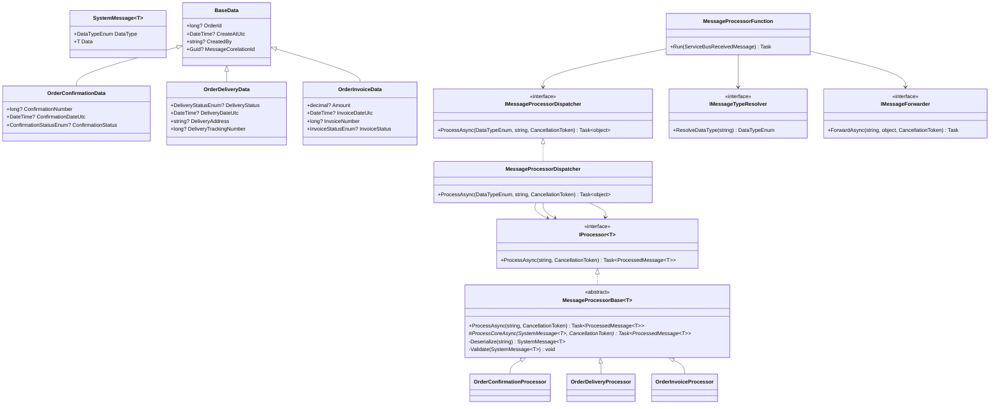

# LLD Interview Wiki — Polymorphic Message Processing Pipeline

> **Archetype:** Event-driven dispatcher with typed payloads, validation, and pluggable forwarding.  
> This pattern appears across product-based interviews at companies that deal with async pipelines, order management, notification systems, and integration hubs (e.g., Amazon, Flipkart, Swiggy, Razorpay, Zomato, Microsoft, Google).

---

### Interview Depth Map

| Level | What you must cover | Sections to focus on |
|-------|--------------------|-----------------------|
| **L4 / SDE-2** | Polymorphism, template method, basic DI, error classification | 1 – 10 |
| **L5 / Senior** | + Middleware pipeline, correlation tracing, outbox pattern, ordered processing | 11 – 15 |
| **L6 / Staff** | + Dynamic dispatch / assembly scanning, distributed guards, exactly-once semantics, deferral | 16 – 18 |

---

## Table of Contents

1. [Problem Statement](#1-problem-statement)
2. [How to Read Such a Problem](#2-how-to-read-such-a-problem)
3. [What to Consider Before Writing a Single Line](#3-what-to-consider-before-writing-a-single-line)
4. [Senior Engineer Mental Framework](#4-senior-engineer-mental-framework)
5. [Design Patterns in Play](#5-design-patterns-in-play)
6. [Component Breakdown](#6-component-breakdown)
7. [Class Diagram](#7-class-diagram)
8. [Step-by-Step Solution Walkthrough](#8-step-by-step-solution-walkthrough)
9. [Error Handling Strategy](#9-error-handling-strategy)
10. [Testability Strategy](#10-testability-strategy)
11. [Extension Points — Adding a New Message Type](#11-extension-points--adding-a-new-message-type)
12. [Anti-Patterns to Call Out](#12-anti-patterns-to-call-out)
13. [Scoring Rubric (What Interviewers Actually Check)](#13-scoring-rubric-what-interviewers-actually-check)
14. [Advanced: Generic Envelope & Rich Base Interface (L5+)](#14-advanced-generic-envelope--rich-base-interface-l5)
15. [Advanced: Ordered Processing — State Machine & Order Guard (L5+)](#15-advanced-ordered-processing--state-machine--order-guard-l5)
16. [Advanced: Middleware Pipeline Pattern (L5+)](#16-advanced-middleware-pipeline-pattern-l5)
17. [Advanced: Outbox Pattern — Guaranteed Integrations (L5+)](#17-advanced-outbox-pattern--guaranteed-integrations-l5)
18. [Advanced: Deferral vs Dead-Letter (L5+)](#18-advanced-deferral-vs-dead-letter-l5)
19. [Advanced: Dynamic Dispatch & Assembly Scanning (L6)](#19-advanced-dynamic-dispatch--assembly-scanning-l6)
20. [Senior Interviewer Q&A Bank](#20-senior-interviewer-qa-bank)

---

## 1. Problem Statement

An Azure Functions app receives JSON messages from an Azure Service Bus topic. Every message is a typed envelope:

```jsonc
{
  "dataType": "OrderConfirmation",   // discriminator
  "data": { /* payload fields */ }
}
```

Three payload types exist today:

| `dataType`          | Payload class             | Key Fields                                         |
|---------------------|---------------------------|----------------------------------------------------|
| `OrderConfirmation` | `OrderConfirmationData`   | confirmationNumber, confirmationDateUtc, status    |
| `OrderDelivery`     | `OrderDeliveryData`       | deliveryStatus, deliveryDateUtc, address, tracking |
| `OrderInvoice`      | `OrderInvoiceData`        | amount, invoiceDateUtc, invoiceNumber, status      |

The pipeline must:

1. **Parse** the raw JSON into the correct strongly-typed model, driven by `dataType`.
2. **Validate** all required fields; dead-letter messages that fail validation.
3. **Process** each type — logic differs per type.
4. **Forward** the processed result via HTTP POST to a type-specific URL from config.
5. Log at each step; handle errors gracefully without crashing the host.

**Constraint:** Business logic must not be welded to `ServiceBusReceivedMessage` or a concrete `HttpClient` — keep it testable.

---

## 2. How to Read Such a Problem

When you encounter this class of problem in an interview, extract the following axes before designing:

### 2.1 Variation Axis
> "What varies, and along which dimension?"

Here, **message type** is the variation axis. The structure, validation rules, and processing logic differ per `dataType`. This immediately signals a need for **polymorphism**.

### 2.2 Stability Axis
> "What stays the same regardless of the variant?"

- The envelope shape (`dataType` + `data`) is always the same.
- The pipeline steps (parse → validate → process → forward) are always the same.
- The forwarding mechanism (HTTP POST) is always the same.

This is the **template** — stable structure that delegates variant steps to subclasses/strategies.

### 2.3 Extension Axis
> "What will be added later?"

The problem explicitly says _"make adding a new message type later easy"_. This means the design must be **Open for extension, Closed for modification** — adding `OrderReturn` tomorrow should require zero changes to existing classes.

### 2.4 Dependency Axis
> "What external systems does this touch, and can we decouple from them?"

- Azure Service Bus (input trigger) — can't control it, but we can keep function thin.
- Downstream HTTP endpoint (output) — must hide behind an interface to allow faking in tests.
- Config (endpoint URLs) — inject via `IOptions<T>`, never hardcode.

---

## 3. What to Consider Before Writing a Single Line

### Domain Modeling
- Does the payload base class capture truly shared fields, or is it just structural inheritance?
- Are status enums the right type for state, or should they be value objects?
- Is `OrderId` the right correlation key across all message types?

### Validation
- Required fields — use `DataAnnotations` + `Validator.TryValidateObject` for consistency and zero boilerplate.
- Business rules (e.g., amount must be positive) — these go in domain objects or a dedicated validator, not in the processor.
- Where does validation failure go? Dead-letter queue, not retry — a bad message will always be bad.

### Error Classification
Not all errors are the same:
| Error Type             | Example                            | Action              |
|------------------------|------------------------------------|---------------------|
| Invalid message        | Missing required field, bad JSON   | Dead-letter, no retry |
| Transient infra error  | Downstream HTTP 503                | Retry (let Service Bus handle) |
| Config error           | No endpoint URL mapped             | Throw, alert ops    |
| Unhandled bug          | NullReferenceException in processor| Retry then dead-letter |

### Testability
- Can I test `OrderConfirmationProcessor` without a real Service Bus? Yes — it must accept a `string` body, not a `ServiceBusReceivedMessage`.
- Can I test the HTTP forwarding without a real server? Yes — inject `IHttpClientFactory`; in tests, use `MockHttpMessageHandler`.
- Can I test the dispatcher without real processors? Yes — inject `IProcessor<T>` interfaces.

### Configuration
- Endpoint URLs are per-type and likely to change per environment — they belong in config, not code.
- Use strongly typed options (`MessageProcessorOptions`) bound via `IOptions<T>`.

---

## 4. Senior Engineer Mental Framework

Senior engineers think in **layers of concern**, not in individual classes. Walk through these layers in order during an interview:

```
┌────────────────────────────────────────────────────────┐
│  Layer 1 — Entry Point (Thin Trigger)                  │
│  Azure Function: receive raw bytes, call pipeline,     │
│  handle infrastructure-level errors (dead-letter)      │
├────────────────────────────────────────────────────────┤
│  Layer 2 — Routing (Type Resolution)                   │
│  Peek at discriminator field → resolve DataTypeEnum    │
│  No deserialization of the full payload yet            │
├────────────────────────────────────────────────────────┤
│  Layer 3 — Parse + Validate (Template Method)          │
│  Base class handles deserialize + validate generically │
│  Subclass only implements business-specific logic      │
├────────────────────────────────────────────────────────┤
│  Layer 4 — Process (Concrete Processors)               │
│  One class per message type                            │
│  Each returns a strongly-typed ProcessedMessage<T>     │
├────────────────────────────────────────────────────────┤
│  Layer 5 — Dispatch (Orchestration)                    │
│  Routes from DataTypeEnum → correct IProcessor<T>      │
│  Returns object so the caller stays type-agnostic      │
├────────────────────────────────────────────────────────┤
│  Layer 6 — Forward (Infrastructure Adapter)            │
│  Hides HTTP behind IMessageForwarder                   │
│  Uses IHttpClientFactory for safe resource management  │
└────────────────────────────────────────────────────────┘
```

**The interview signal here:** Naming each layer explicitly and explaining *why* you separated them scores far higher than writing classes without articulating boundaries.

---

## 5. Design Patterns in Play

### 5.1 Template Method Pattern
`MessageProcessorBase<T>` defines the fixed algorithm:
1. Deserialize
2. Validate
3. Call abstract `ProcessCoreAsync` (deferred to subclass)

Subclasses only override step 3. The invariants (deserialize, validate) are never duplicated.

### 5.2 Strategy / Polymorphism
Each concrete processor (`OrderConfirmationProcessor`, etc.) is a strategy for how to process that specific type. They are interchangeable from the dispatcher's perspective.

### 5.3 Dispatcher / Command Router
`MessageProcessorDispatcher` acts as a router: given a `DataTypeEnum`, it picks the right `IProcessor<T>` and invokes it. This is the classic **Command Router** pattern — new types require only adding a new `case`, not rewriting logic.

### 5.4 Adapter Pattern
`HttpMessageForwarder` adapts the concrete `HttpClient` to the domain-level `IMessageForwarder` interface. The domain doesn't know or care that HTTP is involved.

### 5.5 Options Pattern (DI-native configuration)
`MessageProcessorOptions` bound via `IOptions<T>` is the .NET idiom for injecting configuration. It's strongly typed, validated at startup, and trivially mockable.

---

## 6. Component Breakdown

```
MessageProcessorFunction        ← Azure Function trigger (thin shell)
│
├── IMessageTypeResolver        ← reads dataType discriminator from raw JSON
│   └── JsonMessageTypeResolver ← concrete implementation
│
├── IMessageProcessorDispatcher ← routes DataTypeEnum → correct processor
│   └── MessageProcessorDispatcher
│       ├── IProcessor<OrderConfirmationData>
│       ├── IProcessor<OrderDeliveryData>
│       └── IProcessor<OrderInvoiceData>
│
├── IMessageForwarder           ← posts result to downstream HTTP endpoint
│   └── HttpMessageForwarder    ← hides HttpClient; uses IHttpClientFactory
│
└── IOptions<MessageProcessorOptions>
    └── EndpointUrls: Dictionary<string, string>

MessageProcessorBase<T>         ← abstract base: parse + validate + delegate
├── OrderConfirmationProcessor
├── OrderDeliveryProcessor
└── OrderInvoiceProcessor

Messages/
├── BaseData                    ← shared fields: OrderId, CreatedBy, CorrelationId, Timestamp
├── OrderConfirmationData
├── OrderDeliveryData
└── OrderInvoiceData

SystemMessage<T>                ← envelope: DataType + Data
ProcessedMessage<T>             ← output envelope: DataType + Data + Summary + ProcessedAt
InvalidMessageException         ← domain exception: signals dead-letter, not retry
```

---

## 7. Class Diagram



---

## 8. Step-by-Step Solution Walkthrough

### Step 1 — Define the Envelope and Discriminator

Start with the data model. Every message has the same envelope shape — a generic wrapper that deserializes correctly once you know the type.

```csharp
// The discriminator enum — drives all routing decisions
public enum DataTypeEnum { Unknown, OrderConfirmation, OrderDelivery, OrderInvoice }

// Generic envelope — T is the payload type
public class SystemMessage<T> where T : BaseData, new()
{
    public required DataTypeEnum DataType { get; set; }
    public required T Data { get; set; }
}
```

**Key decision:** Use an `enum` (not a raw string) as the discriminator. It makes `switch` exhaustiveness checkable, prevents typos, and is a stable contract.

---

### Step 2 — Define Shared Base and Typed Payloads

Pull shared audit fields into `BaseData`. Concrete payload classes only add their own fields.

```csharp
public abstract class BaseData
{
    [Required] public long? OrderId { get; set; }
    [Required] public DateTime? CreateAtUtc { get; set; }
    [Required, MinLength(1)] public string? CreatedBy { get; set; }
    [Required] public Guid? MessageCorelationId { get; set; }
}

public class OrderConfirmationData : BaseData
{
    [Required] public long? ConfirmationNumber { get; set; }
    [Required] public DateTime? ConfirmationDateUtc { get; set; }
    [Required] public ConfirmationStatusEnum? ConfirmationStatus { get; set; }
}
```

**Key decision:** `DataAnnotations` on properties — not manual `if` checks — so validation is declarative, composable, and covered by `Validator.TryValidateObject` without writing a single line of validation logic per field.

**Key decision:** All fields are nullable with `[Required]`. This lets JSON deserialization succeed even when the field is absent, so the validator (not the deserializer) produces the user-friendly error message.

---

### Step 3 — Define the IProcessor Abstraction

The core contract: given a raw message string, produce a processed result.

```csharp
public interface IProcessor<T> where T : BaseData, new()
{
    Task<ProcessedMessage<T>> ProcessAsync(string messageBody, CancellationToken cancellationToken = default);
}
```

**Key decision:** Accept `string messageBody`, not `ServiceBusReceivedMessage`. The processor knows nothing about Service Bus — it only knows about its own domain. This is the single most important testability decision.

---

### Step 4 — Implement the Template Method Base

The base class owns parse and validate. Subclasses only implement `ProcessCoreAsync`.

```csharp
public abstract class MessageProcessorBase<T> : IProcessor<T> where T : BaseData, new()
{
    public async Task<ProcessedMessage<T>> ProcessAsync(string messageBody, CancellationToken cancellationToken = default)
    {
        var systemMessage = Deserialize(messageBody);
        Validate(systemMessage);
        return await ProcessCoreAsync(systemMessage, cancellationToken);
    }

    protected abstract Task<ProcessedMessage<T>> ProcessCoreAsync(
        SystemMessage<T> systemMessage, CancellationToken cancellationToken);

    private static SystemMessage<T> Deserialize(string messageBody)
    {
        try
        {
            return JsonSerializer.Deserialize<SystemMessage<T>>(messageBody, Options)
                   ?? throw new InvalidMessageException($"Deserialization returned null for {typeof(T).Name}.");
        }
        catch (JsonException ex)
        {
            throw new InvalidMessageException($"Invalid JSON for {typeof(T).Name}.", ex);
        }
    }

    private static void Validate(SystemMessage<T> systemMessage)
    {
        var results = new List<ValidationResult>();
        if (!Validator.TryValidateObject(systemMessage.Data, new ValidationContext(systemMessage.Data), results, true))
        {
            var errors = string.Join("; ", results.Select(r => r.ErrorMessage).Where(e => e != null));
            throw new InvalidMessageException($"Payload invalid: {errors}");
        }
    }
}
```

**Key decision:** `JsonException` is caught and re-thrown as `InvalidMessageException`. This means the caller only needs to handle one exception type for all "bad message" scenarios — it doesn't need to know whether the failure was a parse error or a validation error.

---

### Step 5 — Implement Concrete Processors

Each processor only contains its type-specific business logic:

```csharp
public sealed class OrderConfirmationProcessor : MessageProcessorBase<OrderConfirmationData>
{
    protected override Task<ProcessedMessage<OrderConfirmationData>> ProcessCoreAsync(
        SystemMessage<OrderConfirmationData> systemMessage, CancellationToken cancellationToken)
    {
        var data = systemMessage.Data;
        return Task.FromResult(new ProcessedMessage<OrderConfirmationData>
        {
            DataType = systemMessage.DataType,
            Data = data,
            Summary = $"Confirmation #{data.ConfirmationNumber} for order {data.OrderId} — {data.ConfirmationStatus}",
            ProcessedAtUtc = DateTimeOffset.UtcNow
        });
    }
}
```

**Key decision:** `ProcessedMessage<T>` is the output envelope. It carries both the original data and a derived `Summary` string. The forwarder serializes this whole object — downstream gets both.

---

### Step 6 — Type Resolution (Peek Before Full Deserialize)

Before deserializing the full payload, peek at only the discriminator field. This avoids allocating a full deserialized object just to route it.

```csharp
public sealed class JsonMessageTypeResolver : IMessageTypeResolver
{
    public DataTypeEnum ResolveDataType(string messageBody)
    {
        using var doc = JsonDocument.Parse(messageBody);
        if (!doc.RootElement.TryGetProperty("dataType", out var el) || el.ValueKind != JsonValueKind.String)
            throw new InvalidMessageException("Missing or non-string dataType field.");

        if (!Enum.TryParse<DataTypeEnum>(el.GetString(), ignoreCase: true, out var dataType) || dataType == DataTypeEnum.Unknown)
            throw new InvalidMessageException($"Unknown dataType '{el.GetString()}'.");

        return dataType;
    }
}
```

**Key decision:** Two-pass approach. First pass reads only `dataType` as a `JsonDocument` (zero allocation for the full graph). Second pass in the processor does full deserialization to the correct generic type. This matters for correctness — you cannot deserialize to the right generic until you know which type to use.

---

### Step 7 — Dispatcher (Route DataTypeEnum → IProcessor)

```csharp
public sealed class MessageProcessorDispatcher : IMessageProcessorDispatcher
{
    public MessageProcessorDispatcher(
        IProcessor<OrderConfirmationData> confirmationProcessor,
        IProcessor<OrderDeliveryData> deliveryProcessor,
        IProcessor<OrderInvoiceData> invoiceProcessor) { ... }

    public Task<object> ProcessAsync(DataTypeEnum dataType, string body, CancellationToken ct)
        => dataType switch
        {
            DataTypeEnum.OrderConfirmation => _confirmationProcessor.ProcessAsync(body, ct).ContinueWith(t => (object)t.Result, ct),
            DataTypeEnum.OrderDelivery     => _deliveryProcessor.ProcessAsync(body, ct).ContinueWith(t => (object)t.Result, ct),
            DataTypeEnum.OrderInvoice      => _invoiceProcessor.ProcessAsync(body, ct).ContinueWith(t => (object)t.Result, ct),
            _                              => throw new InvalidMessageException($"Unsupported dataType '{dataType}'.")
        };
}
```

**Key decision:** Returns `Task<object>`. This is the covariance escape hatch — `ProcessedMessage<OrderConfirmationData>` and `ProcessedMessage<OrderDeliveryData>` have no common generic base, so `object` is used. The forwarder serializes the object; downstream systems receive full typed JSON regardless.

**Alternative considered:** A `IProcessedMessage` non-generic base interface. Equally valid — but adds more ceremony for the same practical result.

---

### Step 8 — HTTP Forwarding via Adapter

```csharp
public sealed class HttpMessageForwarder : IMessageForwarder
{
    private readonly IHttpClientFactory _factory;

    public async Task ForwardAsync(string url, object payload, CancellationToken ct)
    {
        var client = _factory.CreateClient(nameof(HttpMessageForwarder));
        using var response = await client.PostAsJsonAsync(url, payload, ct);

        if (!response.IsSuccessStatusCode)
        {
            var body = await response.Content.ReadAsStringAsync(ct);
            throw new HttpRequestException($"Downstream {url} returned {(int)response.StatusCode}. {body}");
        }
    }
}
```

**Key decision:** `IHttpClientFactory.CreateClient()` — never `new HttpClient()`. Factory manages socket pooling and DNS TTL. Using `new HttpClient()` in a high-throughput function is a socket exhaustion bug waiting to happen.

---

### Step 9 — Wire the Entry Point (Thin Function)

The Azure Function itself is just an orchestrator. It touches infrastructure (Service Bus, dead-lettering) and delegates everything else.

```csharp
[Function(nameof(MessageProcessorFunction))]
public async Task Run(
    [ServiceBusTrigger(...)] ServiceBusReceivedMessage message,
    ServiceBusMessageActions messageActions,
    CancellationToken cancellationToken)
{
    var payload = message.Body.ToString();
    try
    {
        var dataType    = _typeResolver.ResolveDataType(payload);
        var endpointUrl = GetEndpointUrl(dataType);                  // from IOptions
        var result      = await _dispatcher.ProcessAsync(dataType, payload, cancellationToken);
        await _forwarder.ForwardAsync(endpointUrl, result, cancellationToken);
    }
    catch (InvalidMessageException ex)
    {
        _logger.LogWarning(ex, "Dead-lettering invalid message {Id}", message.MessageId);
        await messageActions.DeadLetterMessageAsync(message, "Invalid message", ex.Message, cancellationToken);
    }
    // HttpRequestException and others bubble up → Service Bus retries
}
```

**Key decision:** Only `InvalidMessageException` is explicitly caught here. Transient infrastructure errors (HTTP 503, network blip) bubble up as unhandled exceptions — Service Bus handles retry and eventual dead-lettering automatically. Don't swallow errors that should trigger retries.

---

### Step 10 — Register in DI (Program.cs)

```csharp
builder.Services.Configure<MessageProcessorOptions>(
    builder.Configuration.GetSection(MessageProcessorOptions.SectionName));

builder.Services.AddHttpClient(nameof(HttpMessageForwarder));

builder.Services.AddSingleton<IMessageTypeResolver, JsonMessageTypeResolver>();
builder.Services.AddSingleton<IMessageForwarder, HttpMessageForwarder>();
builder.Services.AddSingleton<IProcessor<OrderConfirmationData>, OrderConfirmationProcessor>();
builder.Services.AddSingleton<IProcessor<OrderDeliveryData>, OrderDeliveryProcessor>();
builder.Services.AddSingleton<IProcessor<OrderInvoiceData>, OrderInvoiceProcessor>();
builder.Services.AddSingleton<IMessageProcessorDispatcher, MessageProcessorDispatcher>();
```

---

## 9. Error Handling Strategy

```
Raw message arrives
       │
       ▼
  ResolveDataType ──── empty/invalid JSON ──────────────────► InvalidMessageException
       │                                                              │
       ▼                                                              ▼
  GetEndpointUrl ──── no config for type ──► InvalidOperationException (config bug, alert ops)
       │
       ▼
  ProcessAsync ──── bad JSON / missing field ───────────────► InvalidMessageException
       │                                                              │
       ▼                                                        dead-letter
  ForwardAsync ──── non-2xx response ──► HttpRequestException
       │                                       │
       ▼                                 bubble up → retry
  Complete message
```

**Rule:** `InvalidMessageException` = dead-letter immediately. Everything else = let it throw so Service Bus can retry.

---

## 10. Testability Strategy

| Component                   | How to test                                                         |
|-----------------------------|---------------------------------------------------------------------|
| `JsonMessageTypeResolver`   | Unit test: pass raw JSON strings, assert `DataTypeEnum` output      |
| `MessageProcessorBase<T>`   | Unit test: pass crafted JSON strings to `OrderConfirmationProcessor`, assert `ProcessedMessage` output |
| `MessageProcessorDispatcher`| Unit test: inject mock `IProcessor<T>`, verify routing by `DataTypeEnum` |
| `HttpMessageForwarder`      | Unit test: inject `MockHttpMessageHandler`, assert POST URL and body |
| `MessageProcessorFunction`  | Integration test: inject all mocks, simulate invalid/valid messages, verify dead-letter calls |

**Key pattern:** Every boundary is an interface. Tests inject fakes. No real HTTP, no real Service Bus, no real config files needed in any unit test.

---

## 11. Extension Points — Adding a New Message Type

To add `OrderReturn` tomorrow:

1. Add `OrderReturn` to `DataTypeEnum`.
2. Create `OrderReturnData : BaseData` in `Messages/` with `[Required]` annotated fields.
3. Create `OrderReturnProcessor : MessageProcessorBase<OrderReturnData>` in `Processor/Impl/`.
4. Add a `case DataTypeEnum.OrderReturn` to `MessageProcessorDispatcher`.
5. Register `IProcessor<OrderReturnData>` in `Program.cs`.
6. Add `OrderReturn` endpoint URL to `local.settings.json`.

**Zero changes** to `MessageProcessorFunction`, `MessageProcessorBase`, `IMessageForwarder`, or `HttpMessageForwarder`. This is the Open/Closed Principle in practice.

---

## 12. Anti-Patterns to Call Out

| Anti-pattern | What it looks like | Why it's a problem |
|---|---|---|
| Fat function | All logic inside `Run()` — parse, switch, process, forward | Untestable, unmaintainable, violates SRP |
| `new HttpClient()` in a loop | `var client = new HttpClient()` per invocation | Socket exhaustion under load |
| Stringly-typed routing | `if (dataType == "OrderConfirmation")` with raw strings | Typos, no compile-time safety |
| Swallowing transient exceptions | Catching `HttpRequestException` and completing the message | Silently drops messages that should retry |
| Direct `ServiceBusReceivedMessage` dependency in processors | `ProcessAsync(ServiceBusReceivedMessage msg)` | Forces Service Bus SDK in tests |
| Hardcoded endpoint URLs | `const string Url = "https://..."` | Breaks multi-environment deployments |
| God dispatcher with business logic | Processing logic inside the `switch` in dispatcher | Dispatch and processing concerns bleed together |

---

## 13. Scoring Rubric (What Interviewers Actually Check)

| Dimension | Poor | Good | Senior |
|---|---|---|---|
| **Domain modelling** | Flat classes, no hierarchy | `BaseData` + typed subclasses | Justified field choices, nullability reasoning |
| **Abstraction** | Concrete dependencies throughout | Some interfaces | Every infra boundary behind an interface |
| **OCP** | Giant `if/else` in one class | Separate classes per type | Adding a type requires no modification to existing code |
| **Validation** | Manual `if` checks, inconsistent | DataAnnotations | Annotations + `Validator.TryValidateObject` + typed exception |
| **Error handling** | Try/catch everything or nothing | Catches InvalidMessageException | Correct dead-letter vs retry distinction articulated |
| **Testability** | "I'd use integration tests" | Some unit tests possible | Every boundary injectable, full unit test strategy named |
| **Config** | Hardcoded values | `appsettings.json` | Strongly-typed `IOptions<T>` with DI |
| **HTTP safety** | `new HttpClient()` | `HttpClient` field | `IHttpClientFactory` with named client |
| **Communication** | Writes code silently | Explains what, not why | Explains trade-offs, calls out what's left out and why |

---

> **TL;DR for interviews (L4):** The moment you see a "process N types of messages differently and forward results," you should reach for **Template Method + Strategy + Dispatcher**. Define your variation axis, stabilise the pipeline shape, hide infrastructure behind interfaces, and make adding a new type a file-add-only operation. Everything else follows.

---

## 14. Advanced: Generic Envelope & Rich Base Interface (L5+)

> Upgrade your envelope design for richer correlation, sequencing, and zero-reflection structured logging.

### The Gap in the Basic Design

The basic design uses `DataTypeEnum` as the discriminator and `BaseData` as a class. This works but has two limitations interviewers at senior level will probe:

1. The dispatcher must maintain a manual `switch` — every new type requires a code change.
2. `BaseData` is a class; you cannot use it with `record` value semantics or deconstruction.

### The Upgrade: `IMessage` + `BaseMessage<TBody>`

```csharp
// Marker interface — all routable messages implement this
public interface IMessage
{
    Guid MessageId { get; }
    Guid CorrelationId { get; }   // ties all messages in ONE business transaction
    int SequenceNumber { get; }   // ordering token within the correlation group
    string MessageType { get; }   // string discriminator (replaces enum for open extensibility)
    DateTimeOffset CreatedAt { get; }
}

// Generic typed envelope — body is strongly typed, envelope carries infrastructure metadata
public abstract record BaseMessage<TBody> : IMessage
{
    public Guid MessageId { get; init; } = Guid.NewGuid();
    public Guid CorrelationId { get; init; }
    public int SequenceNumber { get; init; }
    public DateTimeOffset CreatedAt { get; init; } = DateTimeOffset.UtcNow;
    public abstract string MessageType { get; }
    public TBody Body { get; init; } = default!;
}
```

### Why this is better

| Concern | Basic (`BaseData` + `DataTypeEnum`) | Advanced (`IMessage` + `BaseMessage<TBody>`) |
|---------|--------------------------------------|----------------------------------------------|
| Routing contract | `DataTypeEnum` — closed enum, must change to add types | `MessageType` string — open, no recompile needed for new producers |
| Payload typing | `BaseData` class hierarchy — payload fields mixed with infra fields | `TBody` is pure domain; envelope is pure infrastructure |
| Structured logging | Must cast to get `CorrelationId` | All middleware works on `IMessage` — no cast for log scope |
| Sequence ordering | Not modelled | `SequenceNumber` enables the Order Guard (see §15) |
| Deconstruction | Classes — mutable by default | `record` — immutable, value equality, non-destructive mutation with `with` |

### Concrete message types with this model

```csharp
public record OrderPlacedMessage : BaseMessage<OrderPlacedBody>
{
    public override string MessageType => "order.placed";
}

public record OrderConfirmedMessage : BaseMessage<OrderConfirmedBody>
{
    public override string MessageType => "order.confirmed";
    public string ConfirmedBy { get; init; } = string.Empty;
}
```

**Interview answer:** *"I moved from `DataTypeEnum` to a string `MessageType` property on the record itself. This means a new producer can publish a new message type without touching the enum — the dispatcher registry auto-discovers it via assembly scanning. The trade-off is we lose compile-time exhaustiveness on `switch`, so we need a registry + fallback dead-letter path instead."*

---

## 15. Advanced: Ordered Processing — State Machine & Order Guard (L5+)

> Azure Service Bus does **not guarantee delivery order** across sessions unless you use Session-enabled queues. Even then, retries can cause a message to arrive before its predecessor was processed. You need an application-level ordering guard.

### The Problem

```
Timeline (what can happen):
  t=0  →  order.placed      arrives, processed ✅
  t=1  →  order.shipped     arrives  ← predecessor order.confirmed NOT YET seen!
  t=2  →  order.confirmed   arrives
```

Without a guard, `order.shipped` would be processed before `order.confirmed` — the DB would record an illegal state transition.

### State Machine — Allowed Transitions

```csharp
public static class OrderFlowTransitions
{
    // State machine: key = current status, value = set of valid next statuses
    private static readonly Dictionary<string, HashSet<string>> _allowed = new()
    {
        { "",                 new() { "order.placed" } },
        { "order.placed",     new() { "order.confirmed", "order.cancelled" } },
        { "order.confirmed",  new() { "order.shipped",   "order.cancelled" } },
        { "order.shipped",    new() { /* terminal */ } },
        { "order.cancelled",  new() { /* terminal */ } },
    };

    public static bool IsAllowed(string current, string next)
        => _allowed.TryGetValue(current, out var allowed) && allowed.Contains(next);

    public static bool IsTerminal(string status)
        => status is "order.shipped" or "order.cancelled";
}
```

### The Order Guard (Redis-backed distributed check)

```csharp
public interface IOrderGuard
{
    // Returns true = process now. Returns false = out-of-order, defer.
    // Throws InvalidOperationException for illegal transitions (dead-letter).
    Task<bool> CanProcessAsync(IMessage message, CancellationToken ct);
    Task MarkProcessedAsync(IMessage message, CancellationToken ct);
}

public class RedisOrderGuard : IOrderGuard
{
    private readonly IDistributedCache _cache;

    public async Task<bool> CanProcessAsync(IMessage message, CancellationToken ct)
    {
        var state = await GetStateAsync($"flow:{message.CorrelationId}", ct)
                    ?? new MessageFlowState { CorrelationId = message.CorrelationId };

        // Duplicate detection — idempotency guard
        if (state.LastProcessedSequence >= message.SequenceNumber)
            return false;  // already processed this or a later message

        // Illegal transition → dead-letter, not retry
        if (!OrderFlowTransitions.IsAllowed(state.CurrentStatus, message.MessageType))
        {
            if (OrderFlowTransitions.IsTerminal(state.CurrentStatus))
                throw new InvalidOperationException(
                    $"Flow is terminal at '{state.CurrentStatus}'. Cannot accept '{message.MessageType}'.");

            return false;  // out-of-order: valid but too early — defer
        }

        return true;
    }

    public async Task MarkProcessedAsync(IMessage message, CancellationToken ct)
    {
        await SetStateAsync($"flow:{message.CorrelationId}", new MessageFlowState
        {
            CorrelationId = message.CorrelationId,
            CurrentStatus = message.MessageType,
            LastProcessedSequence = message.SequenceNumber,
            LastUpdated = DateTimeOffset.UtcNow,
        }, ct);
    }
}
```

### Why Redis (not SQL) for the Guard?

| Factor | Redis | SQL |
|--------|-------|-----|
| Latency | Sub-millisecond | 1-20ms (hot path overhead) |
| Data lifetime | TTL-based self-expiry | Requires explicit cleanup job |
| Scale | Horizontally partitioned by key | Requires careful indexing |
| Failure mode | Fail-open (allow processing) or fail-closed | Always consistent but slower |

**Interview answer:** *"The order guard is on the hot path of every message. Redis gives us O(1) get/set with sub-millisecond latency and TTL-based cleanup — once an order is terminal and the TTL expires, the state self-cleans. If Redis goes down, we have two choices: fail-open (accept the rare duplicate) if SLA demands availability, or fail-closed (reject until Redis recovers) if SLA demands correctness. For a payment system I'd fail-closed."*

---

## 16. Advanced: Middleware Pipeline Pattern (L5+)

> Cross-cutting concerns (logging, ordering, outbox) should not live inside handlers. They belong in a **middleware pipeline** — the same concept as ASP.NET Core middleware.

### The Contract

```csharp
public delegate Task MessageHandlerDelegate(IMessage message, CancellationToken ct);

public interface IMessageMiddleware
{
    Task InvokeAsync(IMessage message, MessageHandlerDelegate next, CancellationToken ct);
}
```

### Three Standard Middlewares

**Middleware 1 — Correlation Logging** (always outermost)
```csharp
public class CorrelationLoggingMiddleware : IMessageMiddleware
{
    public async Task InvokeAsync(IMessage message, MessageHandlerDelegate next, CancellationToken ct)
    {
        using var scope = _logger.BeginScope(new Dictionary<string, object>
        {
            ["CorrelationId"]  = message.CorrelationId,
            ["MessageId"]      = message.MessageId,
            ["MessageType"]    = message.MessageType,
            ["SequenceNumber"] = message.SequenceNumber,
        });

        _logger.LogInformation("[START] {MessageType}", message.MessageType);
        var sw = Stopwatch.StartNew();
        try
        {
            await next(message, ct);
            _logger.LogInformation("[END] {MessageType} in {Ms}ms", message.MessageType, sw.ElapsedMilliseconds);
        }
        catch (Exception ex)
        {
            _logger.LogError(ex, "[FAIL] {MessageType}", message.MessageType);
            throw;
        }
    }
}
```

**Middleware 2 — Order Guard** (parks out-of-order messages)
```csharp
public class OrderGuardMiddleware : IMessageMiddleware
{
    public async Task InvokeAsync(IMessage message, MessageHandlerDelegate next, CancellationToken ct)
    {
        if (!await _guard.CanProcessAsync(message, ct))
        {
            await _deferral.DeferAsync(message, ct);
            return;
        }

        await next(message, ct);

        // Mark AFTER handler succeeds — atomicity guarantee
        await _guard.MarkProcessedAsync(message, ct);
    }
}
```

**Middleware 3 — Outbox Publisher** (fires integrations after handler success)
```csharp
public class OutboxMiddleware : IMessageMiddleware
{
    public async Task InvokeAsync(IMessage message, MessageHandlerDelegate next, CancellationToken ct)
    {
        await next(message, ct);  // handler runs first
        // Only reached on success
        await _outbox.PublishPendingAsync(message.CorrelationId, ct);
    }
}
```

### Pipeline Builder

```csharp
public class MessagePipeline
{
    private readonly IEnumerable<IMessageMiddleware> _middlewares;

    public MessageHandlerDelegate Build(MessageHandlerDelegate terminal)
    {
        var pipeline = terminal;
        foreach (var middleware in _middlewares.Reverse())
        {
            var current = middleware;
            var next    = pipeline;
            pipeline    = (msg, ct) => current.InvokeAsync(msg, next, ct);
        }
        return pipeline;
    }
}
```

### Execution order

```
Request →  CorrelationLogging  →  OrderGuard  →  OutboxMiddleware  →  Handler
Response ←  CorrelationLogging  ←  OrderGuard  ←  OutboxMiddleware  ←  Handler
```

**Interview answer:** *"I use the same Russian-doll (chain-of-responsibility) pattern as ASP.NET Core middleware. Each middleware receives a `next` delegate and decides whether to call it, short-circuit, or wrap it. This means I can add or remove cross-cutting behaviour — say, a rate-limiter or a dead-letter circuit breaker — without touching any handler."*

---

## 17. Advanced: Outbox Pattern — Guaranteed Integrations (L5+)

> The biggest correctness risk in event-driven systems: **dual write**. Handler saves to DB ✅, then calls Payment API ❌ (network failure). Message is retried. **Payment is charged twice.** 💀

### How the Outbox Pattern Prevents This

1. The handler writes an `OutboxEntry` to the **same database transaction** as the order update.
2. If the handler throws → transaction rolls back → no outbox entry → no duplicate call.
3. If the message is retried → handler does an idempotent `UpsertAsync` → outbox entry already exists with `IsPublished = true` → sweeper skips it.
4. The outbox entry carries `EntryId` sent as `Idempotency-Key` header → downstream deduplicates on its side too.

### Contracts

```csharp
public enum IntegrationType { PaymentGateway, WarehouseApi, NotificationService }

public class OutboxEntry
{
    public Guid EntryId { get; init; } = Guid.NewGuid();
    public IntegrationType IntegrationType { get; init; }
    public string Payload { get; init; } = string.Empty;
    public bool IsPublished { get; set; }
}

public interface IOutboxService
{
    // Enqueue an entry — must be called inside the same DB transaction as the handler write
    Task EnqueueAsync(Guid correlationId, OutboxEntry entry, CancellationToken ct);

    // Called by OutboxMiddleware after handler success to fire all pending entries
    Task PublishPendingAsync(Guid correlationId, CancellationToken ct);
}
```

### Integration Callers (Strategy per IntegrationType)

```csharp
public interface IIntegrationCaller
{
    IntegrationType Type { get; }
    Task CallAsync(string payload, CancellationToken ct);
}

// OutboxService routes to the right caller at runtime
public class OutboxService : IOutboxService
{
    private readonly Dictionary<IntegrationType, IIntegrationCaller> _callers;

    public OutboxService(IOutboxRepository repo, IEnumerable<IIntegrationCaller> callers, ...)
        => _callers = callers.ToDictionary(c => c.Type);

    public async Task PublishPendingAsync(Guid correlationId, CancellationToken ct)
    {
        var pending = await _repo.GetUnpublishedAsync(correlationId, ct);
        foreach (var entry in pending)
        {
            try
            {
                await _callers[entry.IntegrationType].CallAsync(entry.Payload, ct);
                await _repo.MarkPublishedAsync(entry.EntryId, ct);
            }
            catch (Exception ex)
            {
                // Don't fail the whole batch — a background sweeper retries unpublished entries
                _logger.LogWarning(ex, "Integration call failed for {EntryId}. Will retry.", entry.EntryId);
            }
        }
    }
}
```

### What the Background Sweeper Does

A Hangfire / hosted `IHostedService` job runs every 30 seconds:
- Queries for `OutboxEntry` rows where `IsPublished = false AND CreatedAt < now - 30s`
- Retries each via the same `IIntegrationCaller`
- Uses `EntryId` as `Idempotency-Key` so retries are safe

**Interview answer:** *"The outbox gives us exactly-once semantics at the application level. The key insight is that the handler and the outbox write are in the **same transaction** — so they are atomic. The actual HTTP call happens outside the transaction, but by then the entry is already persisted. Even if the process crashes between 'entry written' and 'HTTP called', the sweeper will pick it up. And because we send `EntryId` as `Idempotency-Key`, even if the downstream API receives the same call twice, it deduplicates."*

---

## 18. Advanced: Deferral vs Dead-Letter (L5+)

> Two different failure lanes. Choosing the wrong one is a common senior-level mistake.

### Decision Table

| Scenario | Action | Reason |
|----------|--------|--------|
| Invalid JSON | **Dead-letter** | Will never become valid; retrying wastes resources |
| Missing required field | **Dead-letter** | Same — structural problem, not transient |
| Illegal state transition (terminal) | **Dead-letter** | Programming error or data corruption |
| Out-of-order arrival (predecessor not yet processed) | **Defer** | The message is valid — it just arrived too early |
| Transient HTTP 503 from downstream | **Bubble up / retry** | Will likely succeed on next attempt |
| Handler bug (NullReferenceException) | **Retry → eventually dead-letter** | Let Service Bus exhaust MaxDeliveryCount |

### How Service Bus Deferral Works

When you call `messageActions.DeferMessageAsync(message)`:
- The message moves to a **Deferred** state in the main queue (not to the DLQ).
- It will **not** be redelivered automatically.
- A **sweeper job** must explicitly re-receive it by its `SequenceNumber`.

```csharp
public interface IMessageDeferralService
{
    Task DeferAsync(IMessage message, CancellationToken ct);
}

// The sweeper job runs on a timer, checks Redis for newly completed predecessor states,
// and calls serviceBusReceiver.ReceiveDeferredMessageAsync(sequenceNumber) to re-enqueue.
```

**Interview answer:** *"Dead-letter is a final parking lot for messages that will never succeed — they need human intervention or replaying from source. Deferral is a temporary hold for messages that are valid but arrived out of sequence. The critical difference: dead-lettered messages don't count against MaxDeliveryCount once dead-lettered, but deferred messages still hold their lock and must be explicitly re-received. I use deferral exclusively for ordering issues and dead-letter for everything else."*

---

## 19. Advanced: Dynamic Dispatch & Assembly Scanning (L6)

> The explicit `switch` in the dispatcher is fine for 3 types. At 30 types it becomes a maintenance burden and an OCP violation. The solution is a **self-populating registry via assembly scanning**.

### The Problem with a Manual Switch

```csharp
// Every new message type forces a change here — violates OCP
return dataType switch
{
    DataTypeEnum.OrderConfirmation => ...,
    DataTypeEnum.OrderDelivery     => ...,
    DataTypeEnum.OrderInvoice      => ...,
    _                              => throw ...
};
```

### Solution: Registry + Reflection-Based Dispatcher

```csharp
public interface IMessageTypeRegistry
{
    Type? Resolve(string messageType);
    void Register(string messageType, Type clrType);
}

// Auto-populated at startup — zero code changes for new message types
public static IServiceCollection AddMessageProcessor(
    this IServiceCollection services, params Assembly[] assemblies)
{
    var registry = new MessageTypeRegistry();

    // Scan for all IMessage implementations and register them by their MessageType string
    var messageTypes = assemblies
        .SelectMany(a => a.GetTypes())
        .Where(t => !t.IsAbstract && !t.IsInterface && t.IsAssignableTo(typeof(IMessage)));

    foreach (var type in messageTypes)
    {
        if (Activator.CreateInstance(type) is IMessage sample)
            registry.Register(sample.MessageType, type);
    }

    // Auto-register all IMessageHandler<T> implementations via reflection
    var handlerTypes = assemblies
        .SelectMany(a => a.GetTypes())
        .Where(t => !t.IsAbstract && t.GetInterfaces().Any(i =>
            i.IsGenericType && i.GetGenericTypeDefinition() == typeof(IMessageHandler<>)));

    foreach (var handlerType in handlerTypes)
    {
        var iface = handlerType.GetInterfaces()
            .First(i => i.IsGenericType && i.GetGenericTypeDefinition() == typeof(IMessageHandler<>));
        services.AddScoped(iface, handlerType);
    }

    services.AddSingleton<IMessageTypeRegistry>(registry);
    return services;
}
```

### Dynamic Dispatcher (uses reflection to invoke the handler)

```csharp
public class MessageDispatcher : IMessageDispatcher
{
    public async Task DispatchAsync(string messageType, string json, CancellationToken ct)
    {
        var clrType = _registry.Resolve(messageType)
            ?? throw new InvalidOperationException($"Unregistered message type: {messageType}");

        var message     = (IMessage)JsonSerializer.Deserialize(json, clrType)!;
        using var scope = _sp.CreateScope();
        var handlerType = typeof(IMessageHandler<>).MakeGenericType(clrType);
        var handler     = scope.ServiceProvider.GetRequiredService(handlerType);

        MessageHandlerDelegate terminal = (msg, token) =>
            (Task)handlerType.GetMethod("HandleAsync")!.Invoke(handler, new object[] { msg, token })!;

        var pipeline = _pipeline.Build(terminal);
        await pipeline(message, ct);
    }
}
```

### Trade-offs

| Aspect | Manual switch | Dynamic registry |
|--------|--------------|-----------------|
| Type safety | Compile-time | Runtime (registry check at startup) |
| Adding a new type | Edit dispatcher + DI | Drop new class in assembly — zero edits |
| Performance | Optimal | One reflection call per dispatch; cache `MethodInfo` if needed |
| Debuggability | Stack trace is clean | Stack trace goes through reflection; harder to read |

**When to use which:** Manual switch for ≤ 5 types and closed domains. Dynamic registry for open domains where new types are added by different teams or without redeploying the dispatcher.

---

## 20. Senior Interviewer Q&A Bank

These are the follow-up questions that differentiate L4 from L5/L6 answers.

---

**Q: Why does `BaseMessage<TBody>` use a generic body instead of putting all fields flat on the message?**

> "Single Responsibility. The **envelope** (`BaseMessage`) carries infrastructure metadata — `CorrelationId`, `SequenceNumber`, `MessageId`. The **body** (`TBody`) carries domain data. Middleware and the dispatcher operate on `IMessage` without importing any domain type. Handlers operate on strongly-typed bodies without caring about `SequenceNumber`. The two layers evolve independently."

---

**Q: How does `CorrelationId` flow end-to-end across services?**

> "The producer (API gateway) generates `CorrelationId = Guid.NewGuid()` when the order is placed. It sets it on the Service Bus message's `CorrelationId` property AND in the JSON body. Our dispatcher puts it in `ILogger.BeginScope`. Every log line within that message's processing automatically carries `CorrelationId`. When the outbox fires HTTP calls to downstream services, we send it as `X-Correlation-ID` header so payment, warehouse, and notification logs all carry the same ID. A single query in Application Insights / Splunk reconstructs the full trace across every service."

---

**Q: How do you handle two Azure Function instances processing the same `CorrelationId` concurrently?**

> "Service Bus provides a message lock — only one consumer holds a given message. But if two messages with the same `CorrelationId` (different `SequenceNumber`) are processed concurrently by two instances, the Redis Order Guard uses an atomic `SETNX` (SET if Not eXists) operation as a distributed lock per `(CorrelationId, SequenceNumber)` pair. Only one instance can win the SETNX; the other sees `false` and defers."

---

**Q: What if `PublishPendingAsync` (outbox) fails halfway — some integrations published, some not?**

> "Each entry is individually marked `IsPublished = true` **after** the HTTP call succeeds. If the process crashes between entry 1 and entry 2, the background sweeper re-processes all unpublished entries. Since we send `EntryId` as `Idempotency-Key`, a second call to the payment gateway with the same key is a no-op on their side. This is why idempotent API contracts with downstream systems are non-negotiable."

---

**Q: How do you add `OrderReturned` as a new message type?**

> "In the basic design: add `OrderReturn` to `DataTypeEnum`, create `OrderReturnData : BaseData`, create `OrderReturnProcessor : MessageProcessorBase<OrderReturnData>`, add a `case` to the dispatcher, register in DI, add endpoint URL to config. Zero changes to existing classes — pure extension.
>
> In the advanced design with assembly scanning: just create `OrderReturnedMessage : BaseMessage<OrderReturnedBody>` and `OrderReturnedHandler : IMessageHandler<OrderReturnedMessage>`. The registry, dispatcher, and DI registration happen automatically at startup."

---

**Q: What's your strategy when a downstream endpoint is down for 10 minutes?**

> "Transient HTTP failures bubble up as `HttpRequestException` from the forwarder. Service Bus retries the message up to `MaxDeliveryCount` (e.g., 10 times with exponential backoff). After exhaustion, it moves to the DLQ. The outbox sweeper for the outbox-based design is independent — it keeps retrying unpublished entries even if the message function's retry cycle is exhausted. For prolonged outages I'd add a circuit breaker (`Polly.CircuitBreaker`) on the `HttpClient` so we fail fast rather than hammering a down endpoint."

---

### Updated Scoring Rubric (All Levels)

| Dimension | L4 Answer | L5 Answer | L6 Answer |
|-----------|-----------|-----------|-----------|
| **Envelope design** | `BaseData` class + enum discriminator | Generic `BaseMessage<TBody>` + string discriminator | Explains envelope vs body separation, record vs class trade-offs |
| **Ordering** | Not considered | Mentions sequencing concern | `IOrderGuard` + Redis state machine + deferral vs dead-letter distinction |
| **Cross-cutting concerns** | Logic in handlers | Some shared base | Middleware pipeline with Logging, OrderGuard, Outbox as separate concerns |
| **Integration reliability** | Direct HTTP call | HTTP via interface | Outbox pattern with idempotency keys, background sweeper, dual-write problem named |
| **Extensibility** | Manual switch | Separate handler classes | Dynamic registry + assembly scanning, zero-touch for new types |
| **Concurrency** | Not considered | Mentions message lock | Redis `SETNX` distributed guard per `(CorrelationId, SequenceNumber)` |
| **Observability** | `Console.WriteLine` | `ILogger` | `CorrelationId` in scope propagated via `X-Correlation-ID` through all downstream calls |
| **Communication** | Writes code silently | Explains what | Explains trade-offs, calls out failure modes, names the pattern before coding it |

---

> **TL;DR for all levels:** L4 — get the pipeline shape right (Template Method + Strategy + Dispatcher + thin trigger). L5 — add the middleware pipeline, correlation tracing, ordered processing guard, and outbox. L6 — replace the manual switch with a dynamic registry, handle competing consumers with distributed locking, and discuss exactly-once semantics end-to-end.
